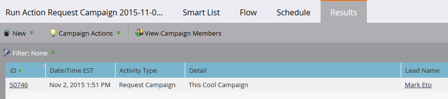

# 캠페인 요청 {#request-campaign}

캠페인 **요청 단일 흐름 단계를 사용하여 특정** 캠페인에 사람들을 배치할 수 있습니다.

>[!NOTE]
>
>배치하려는 캠페인은 활성 상태여야 하며 ** [캠페인이 요청](../../../../product-docs/core-marketo-concepts/smart-campaigns/using-smart-campaigns/setting-up-a-trigger-smart-campaign-for-sales-using-campaign-is-requested.md)** 트리거여야 합니다.

1. 데이터베이스에서 **원하는**&#x200B;사람/사람을 찾아서 선택합니다.

   

1. 사람 **작업을**&#x200B;클릭하고 **특수**&#x200B;위로 마우스를 **가져간**&#x200B;다음 캠페인요청을 선택합니다.

   

1. 배치하려는 캠페인을 선택하고 지금 **실행을 클릭합니다**.

   

1. 화면 오른쪽 상단에서 작업이 완료되었을 때 확인할 수 있습니다. 결과 **보기를 클릭합니다**.

   

   이제 요청된 캠페인에 있습니다.

   

   멋진 작품!

>[!TIP]
>
>캠페인이 **요청된** 트리거 또는 필터를 사용하여 이 흐름 단계의 영향을 받는 사람을 찾습니다.

