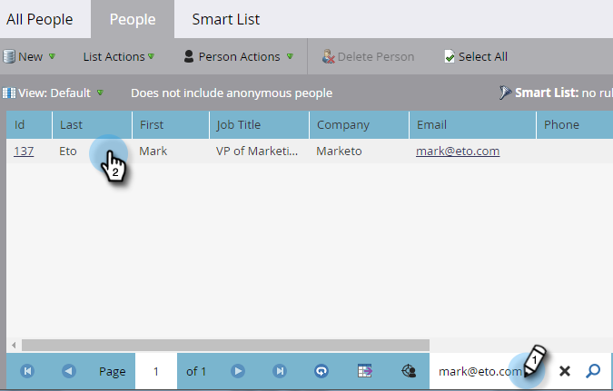

# 캠페인 요청 {#request-campaign}

&quot;[!UICONTROL Request Campaign]&quot; 단일 흐름 단계를 사용하여 사람들을 특정 캠페인에 배치할 수 있습니다.

>[!NOTE]
>
>사용자를 배치하는 캠페인은 활성화되어야 하며 [캠페인이 요청됨](/help/marketo/product-docs/core-marketo-concepts/smart-campaigns/using-smart-campaigns/setting-up-a-trigger-smart-campaign-for-sales-using-campaign-is-requested.md){target="_blank"} 트리거가 있어야 합니다.

1. **[!UICONTROL Database]**&#x200B;에서 원하는 사용자/사용자를 찾아 선택합니다.

   

1. **[!UICONTROL Person Actions]**&#x200B;을(를) 클릭하고 **[!UICONTROL Special]** 위로 마우스를 가져간 다음 **[!UICONTROL Request Campaign]**&#x200B;을(를) 선택합니다.

   

1. 해당 사용자를 배치할 캠페인을 선택하고 **[!UICONTROL Run Now]**&#x200B;을(를) 클릭합니다.

   

1. 화면 오른쪽 상단에서 작업이 완료되면 표시됩니다. **[!UICONTROL View Results]**&#x200B;를 클릭합니다.

   

   현재 요청한 캠페인에 있습니다.

   

   멋진 작품이야!

>[!TIP]
>
>이 흐름 단계의 영향을 받는 사람을 찾으려면 &quot;[!UICONTROL Campaign is Requested]&quot; 트리거 또는 필터를 사용하십시오.
