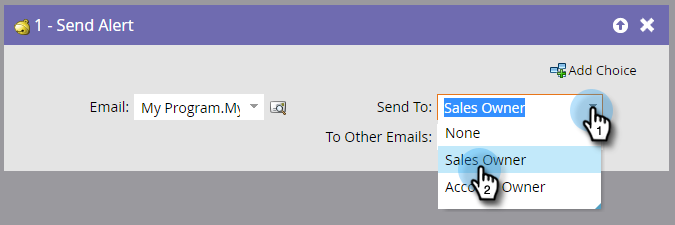

# 경고 보내기 {#send-alert}

Marketo Engage은 영업 소유자, 파트너 또는 다른 사람에게 개인 정보가 포함된 이메일 경고를 보낼 수 있습니다. &quot;[!UICONTROL 경고 보내기]&quot; 흐름 단계를 사용하십시오.

1. 보낼 이메일을 찾아 선택합니다.

   

   >[!NOTE]
   >
   >전자 메일 경고는 모든 헤더 정보를 포함하고 **[!UICONTROL 승인됨]** 상태여야 합니다.

1. 미리 보기 아이콘을 클릭하여 올바른 이메일을 선택했는지 확인할 수 있습니다.

   

   >[!NOTE]
   >
   >전자 메일에 &quot;[!UICONTROL 경고 정보 보내기]&quot; 토큰을 사용하십시오.

1. 경고 수신자를 선택합니다. [!UICONTROL 영업 담당자] 또는 [!UICONTROL 계정 담당자]를 선택할 수 있습니다.

   

1. 선택적으로, 원하는 다른 이메일 주소(쉼표 또는 세미콜론으로 구분)를 추가합니다.

   

   >[!TIP]
   >
   >트리거 캠페인에서는 값이 유효한 이메일 주소이면 **[!UICONTROL 다른 이메일(예: `{{lead.Territory Owner}}` 또는 `{{my.Alert Recipient}}`)에 토큰을 사용할 수 있습니다.]** **[!UICONTROL 다른 전자 메일에 대한]**&#x200B;의 토큰은 일괄 처리 캠페인에서 작동하지 않습니다.

>[!MORELIKETHIS]
>
>[전자 메일 만들기](/help/marketo/product-docs/email-marketing/general/creating-an-email/create-an-email.md){target="_blank"}
