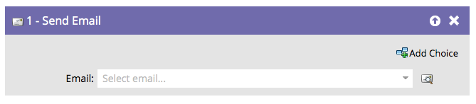
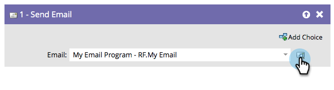

# 이메일 보내기 {#send-email}

&quot;[!UICONTROL 전자 메일 보내기]&quot; 흐름 단계는 캠페인의 일부나 사람들에게 전자 메일을 보내는 단일 흐름 단계로 사용할 수 있습니다.

흐름 단계에서 선택한 이메일을 바로 미리 볼 수 있습니다.

1. 보낼 이메일을 찾아 선택합니다.

   

   >[!NOTE]
   >
   >흐름 단계에서 이메일을 선택하려면 이메일을 승인해야 합니다.

1. 미리 보기 아이콘을 클릭하여 현재 선택한 이메일을 확인합니다.

   

이메일을 볼 수 있는 새 탭/창이 열립니다.
