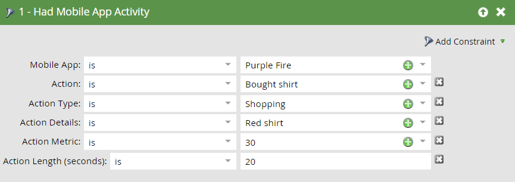

# 모바일 스마트 캠페인에 대한 트리거 및 필터 {#triggers-and-filters-for-mobile-smart-campaigns}

모바일 앱 스마트 캠페인에 대한 트리거 및 필터를 설정할 수 있습니다.

대부분의 활동에는 트리거, 필터 및 비활동 필터가 있습니다. 비활성 필터를 사용하여 푸시 알림을 탭하는 등 발생하지 *않은* 동작을 추적할 수 있습니다.

* 모바일 앱이 설치됨/설치됨
* 모바일 앱 열기
* 모바일 앱 활동 있음/있음
* 모바일 앱 세션이 있음/있음
* 탭/탭 모바일 푸시 알림

이 활동에는 필터만 있습니다.

* 보낸 푸시 알림 - 필터 및 비활동 필터

오른쪽 패널에서 **모바일 앱을** 검색하여 모든 모바일 앱 트리거 및 필터를 나열합니다.

## 제한 {#constraints}

트리거 및 필터와 함께 제약 조건을 사용하여 데이터를 추가로 정렬할 수 있습니다.

보낸 푸시 알림을 제외한 모든 트리거 및 필터에는 다음과 같은 두 가지 표준 제한이 포함되어 있습니다.

* 장치 유형 - iPod, iPhone, iPhone 6 Plus, iPad mini, iPad, Android 스마트폰, Android 태블릿, 알 수 없음(사전 설정 목록)

* 플랫폼 - iPhone 또는 Android

일부 트리거 및 필터는 다음과 같은 추가 제한을 제공합니다.

* 앱 버전 - 최신 버전이 아닌 사용자를 타깃팅하는 방법입니다. 예를 들어 최신 앱 버전이 2.0인 경우 이를 사용하여 앱 버전 2.0에 없는 사용자를 찾을 수 있습니다

* 설치 소스 - 현재 유일한 옵션은 API입니다.

* 로케일 - 장치의 설정

* 모바일 앱 - 특정 앱의 이름입니다. 둘 이상의

* 플랫폼 버전 - OS 버전

* 세션 길이(초) - 앱이 포그라운드에 있는 세션 시간

* 푸시 활성화 여부 - **true** 는 푸시 알림을 전송할 수 있음을 의미합니다. **거짓이란** 그들이 할 수 없다는 것을 의미한다.예를 들어, 사용자가 푸시 알림 수신에서 옵트아웃했을 수 있습니다.

## 트리거 및 필터 {#triggers-and-filters}

**모바일 앱 있음**

이 필터를 사용하여 앱을 설치한 적이 있는 모든 사용자를 확인하십시오. 필터로만 사용할 수 있습니다.

>[!NOTE]
>
>Marketing to가 앱 설치 취소를 추적하지 않으므로 이 필터는 현재 설치와 이전 설치를 모두 찾습니다.

**제한**:장치 유형, 플랫폼, 모바일 앱, 모바일 앱 버전, 장치 유형, 설치 소스, 푸시가 활성화됨, 로케일

>[!TIP]
>
>푸시 알림을 받아야 하는 사람의 스마트 목록을 정의할 때 모바일 앱 = true 및 푸시 활성화 = true뿐만 아니라 모바일 앱의 이름을 지정하는 것이 좋습니다.

모바일 앱이 설치됨/설치됨

* 모바일 앱이 설치됨 - 트리거

* 모바일 앱이 설치됨 - 필터

* NOT 모바일 앱이 설치됨 - 비활동 필터

**제한**:장치 유형, 플랫폼, 앱 버전, 로케일 및 설치 소스

모바일 앱 열기

* 모바일 앱 열기 - 트리거

* 모바일 앱이 열림 - 필터

* NOT 모바일 앱이 열려 있음 - 비활동 필터

**제한**:디바이스 유형 및 플랫폼

모바일 앱 활동 있음/있음

사용자 지정 모바일 활동을 추적하는 강력한 방법을 제공합니다. 개발자와 협력하여 Android [및 iOS용 추적](http://developers.marketo.com/documentation/mobile/installation-instructions-on-android) 을 설정해야 [합니다](http://developers.marketo.com/documentation/mobile/installation-instructions-on-ios).

* 모바일 앱 활동 있음 - 트리거

* 모바일 앱 활동 - 필터

* 모바일 앱 활동 없음 - 비활동 필터

**제한**:디바이스 유형 및 플랫폼과 5개의 추가 디바이스:

* 동작 - 사용자 정의 모바일 활동

* 작업 유형 - (선택 사항) 여러 작업을 분류하는 데 사용되는 텍스트 필드

* 작업 세부 사항 - (선택 사항) 작업에 대한 추가 정보를 제공하는 텍스트 필드

* 작업 지표 - (선택 사항) 작업에 대한 추가 정보를 제공하는 숫자 필드(예: 가격)

* 작업 길이(초) - (선택 사항) 사용자가 작업을 완료하는 데 걸린 시간을 캡처하는 데 사용할 수 있는 숫자 필드

동작 제약조건에서는 트리거 및 필터를 사용하여 모바일 활동을 매우 가깝게 추적할 수 있습니다.

>[!NOTE]
>
>**예**
>
>쇼핑 *의 작업 유형*&#x200B;아래에서, 여기에 그것을 정의하는 다른 제약과 함께 매우 구체적인 작업이 있습니다.
>
>* 셔츠 구입
>  * 빨간색이었어요
>  * 30달러입니다
>  * 구입하는 데 20초가 걸렸다

Marketing To에서 필터가 표시되는 방식은 다음과 같습니다.   

>[!NOTE]
>
>**예**
>
>동일한 작업 유형 아래에서 여러 작업을 가질 수 있습니다. 실제로 일반적인 쇼핑 경험에는 쇼핑 아래에 여러 개의 열이 포함될 수 있습니다. 그럼 양말 좀 신어 주시겠어요?
>
>| 작업 유형 | 쇼핑 | 쇼핑 |
>|---|---|---|
>| 작업 | 셔츠 구입 | 바지 구입 |
>| 작업 세부 사항 | 색상 | 색상 |
>| 작업 지표 | 가격 | 가격 |

**모바일 앱 세션이 있음/있음**

* 모바일 앱 세션이 있음 - 트리거

* 모바일 앱 세션 - 필터

* 모바일 앱 세션 없음 - 비활동 필터

**제한**:장치 유형, 플랫폼 및 세션 길이(초)

탭/탭 푸시 알림

* 푸시 알림 - 트리거

* 탭 푸시 알림 - 필터

* 누르지 않음 푸시 알림 - 비활성 필터

**제한**:장치 유형, 플랫폼, 모바일 앱 버전, 푸시 알림 및 플랫폼 버전

>[!TIP]
>
>탭되지 않음 푸시 알림 비활성화 필터를 사용하여 최근에 전송된 푸시 알림을 탭하지 않은 사람을 찾아 이메일을 통해 후속 작업을 수행할 수 있습니다.

**보낸 푸시 알림** 이 작업은 필터로만 사용할 수 있습니다.

* 보낸 푸시 알림 - 필터

* 푸시 알림이 전송되지 않음 - 비활동 필터

**제한**:푸시 알림 및 모바일 앱

>[!MORELIKETHIS]
>
>* [스마트 목록 필터에 제한 추가](../../../../product-docs/core-marketo-concepts/smart-lists-and-static-lists/using-smart-lists/add-a-constraint-to-a-smart-list-filter.md)
>* [스마트 목록에서 비활동 필터 사용](../../../../product-docs/core-marketo-concepts/smart-lists-and-static-lists/using-smart-lists/use-inactivity-filters-in-a-smart-list.md)

