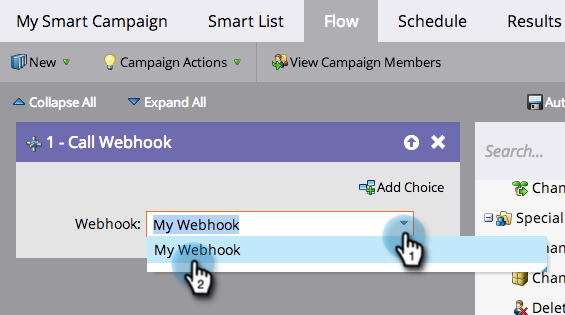

# 스마트 캠페인에서 웹후크 사용 {#use-a-webhook-in-a-smart-campaign}

[Webhook](https://experienceleague.adobe.com/en/docs/marketo-developer/marketo/webhooks/webhooks){target="_blank"}을(를) 사용하려면 [Smart Campaign](/help/marketo/product-docs/core-marketo-concepts/smart-campaigns/flow-actions/add-a-flow-step-to-a-smart-campaign.md){target="_blank"}에 흐름 작업으로 추가하십시오.

>[!AVAILABILITY]
>
>모든 Marketo Engage 사용자가 이 기능을 구입한 것은 아닙니다. 자세한 내용은 Adobe 계정 팀(계정 관리자)에 문의하십시오.

1. [스마트 캠페인을 만듭니다](/help/marketo/product-docs/core-marketo-concepts/smart-campaigns/creating-a-smart-campaign/create-a-new-smart-campaign.md){target="_blank"}.

   >[!NOTE]
   >
   >웹후크는 트리거 캠페인에서만 사용할 수 있습니다.

1. **[!UICONTROL Flow]** 탭으로 이동하여 **[!UICONTROL Call Webhook]** 흐름 작업을 드래그합니다.

   

1. **[!UICONTROL Webhook]**&#x200B;을(를) 선택합니다.

   

1. 스마트 목록에서 웹후크를 사용할 수도 있습니다.

   

1. 마지막으로, 흐름 단계에서 **[!UICONTROL Add Choice]**&#x200B;의 웹후크를 사용할 수 있습니다.

   
