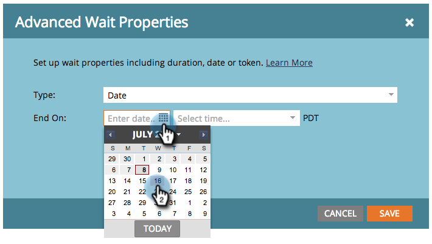

# 대기 플로우 단계에서 특정 날짜 사용 {#use-a-specific-date-in-a-wait-flow-step}

&quot;[!UICONTROL Wait]&quot; 흐름 단계를 사용하여 특정 날짜까지 Smart Campaign을 통해 개인의 여정을 일시 중지할 수 있습니다.

1. 스마트 캠페인 **[!UICONTROL Flow]** 탭에서 **[!UICONTROL Wait]** 흐름 단계 위로 끌어서 놓습니다.

   

1. 톱니바퀴 아이콘을 클릭합니다.

   

1. **[!UICONTROL Type]** 드롭다운에서 **[!UICONTROL Date]**&#x200B;을(를) 선택합니다.

   

1. 다시 시작할 특정 날짜를 선택합니다.

   

1. 시간(선택 사항)을 지정하고 **[!UICONTROL Save]**&#x200B;을(를) 클릭합니다.

   

>[!MORELIKETHIS]
>
>* [대기 흐름 단계에서 기간 사용](/help/marketo/product-docs/core-marketo-concepts/smart-campaigns/flow-actions/wait/use-a-duration-in-a-wait-flow-step.md){target="_blank"}
>* [대기 흐름 단계에서 날짜 토큰 사용](/help/marketo/product-docs/core-marketo-concepts/smart-campaigns/flow-actions/wait/use-a-date-token-in-a-wait-flow-step.md){target="_blank"}
