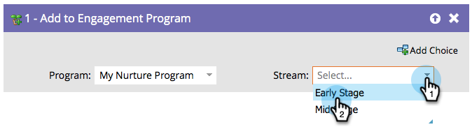

# 참여 프로그램에 추가 {#add-to-engagement-program}

이 흐름 단계를 통해 구축하는 스마트 캠페인은 참여 프로그램의 게이트웨이가 됩니다.

1. 직원을 추가할 참여 프로그램을 선택합니다.

   

1. 사용자를 배치할 스트림을 선택합니다.

   

   >[!NOTE]
   >
   >동일한 프로그램 내에서 여러 스트림에 사용자를 추가할 수 없습니다.
