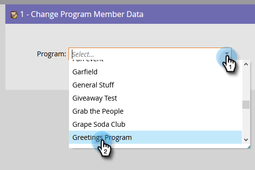
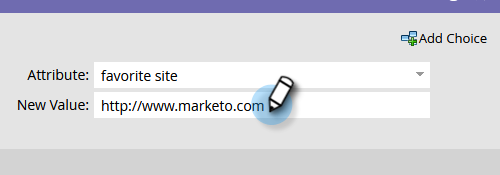

# 프로그램 멤버 데이터 변경 {#change-program-member-data}

Marketo을 사용하여 데이터 값 변경 흐름 작업을 활용하여 필드의 값을 업데이트할 수 있습니다.

>[!NOTE]
>
>필드가 업데이트되지 않도록 차단할 수도 있습니다. 자세한 내용은 필드에 대한 업데이트 차단 을 참조하십시오.

1. 스마트 캠페인의 흐름 탭에서 **[!UICONTROL 프로그램 멤버 데이터 변경]** 흐름 단계를 수행하고 원하는 프로그램을 선택합니다.

   

1. 값을 변경할 속성을 찾아 선택합니다.

   

1. 원하는 속성 값을 입력합니다.

   

>[!NOTE]
>
>다음에서 토큰을 사용할 수도 있습니다. [!UICONTROL 새 값].

이제 스마트 캠페인을 실행하면 됩니다!

>[!TIP]
>
>필드를 업데이트하는 대신 지우려면 &quot;NULL&quot;(따옴표 없음, 모두 대문자)을 [!UICONTROL 새 값].

>[!MORELIKETHIS]
>
>* [흐름 단계에서 토큰 사용](/help/marketo/product-docs/core-marketo-concepts/smart-campaigns/flow-actions/use-tokens-in-flow-steps.md){target="_blank"}
>* [필드에 데이터 추가](/help/marketo/product-docs/core-marketo-concepts/smart-campaigns/flow-actions/append-data-to-a-field.md){target="_blank"}
