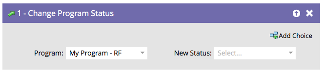

# 프로그램 상태 변경 {#change-program-status}

## 개요 {#overview}

프로그램 상태는 사람들이 프로그램 또는 이벤트를 어떻게 진행하는지를 추적하는 데 도움이 됩니다. [채널 사용자 지정, 만들기 및 관리](../../../../product-docs/administration/tags/create-a-program-channel.md)에서 자세한 정보를 찾습니다.

>[!CAUTION]
>
>참여 프로그램에서 프로그램 상태를 변경하면 자동으로 첫 번째 스트림에 추가됩니다. 컨텐츠 수신을 시작합니다.

## 사용량 {#usage}

1. **프로그램 상태 변경** 흐름 단계에서 드래그합니다.

   

1. 설정할 **새 상태**&#x200B;를 선택합니다. 이 사람은 아직 이 프로그램의 회원이 되지 않았다면 될 것이다.

   

선택 사항은 해당 프로그램의 유효한 상태로 제한됩니다.

>[!NOTE]
>
>관리자는 관리의 채널 편집기에 정의된 이전 프로그램 상태로 뒤로 이동할 수 없습니다.

상태는 사람을 추적하고 보고를 위한 강력한 도구입니다. 시간을 낼 가치가 있어요.