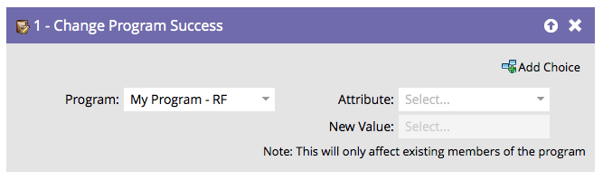

# 프로그램 변경 성공 {#change-program-success}

프로그램 성공으로 잘못 표시된 사용자 그룹이 있는 경우 이 흐름 단계를 사용하여 성공을 true 또는 false로 설정할 수 있습니다.

1. 이 흐름 단계에서 드래그하면 편집 중인 스마트 캠페인이 포함된 프로그램으로 프로그램이 자동으로 설정됩니다.

   >[!NOTE]
   >
   >프로그램의 멤버만 영향을 받습니다.

   

1. **[!UICONTROL 성공]** 또는 **[!UICONTROL 성공 날짜]**&#x200B;를 특성으로 선택합니다.

   

   >[!NOTE]
   >
   >성공 날짜를 아무 것이나 설정하면 자동으로 성공이 true로 설정됩니다. Success를 true로 설정하면 성공 날짜가 현재 날짜로 자동 설정됩니다.

1. **[!UICONTROL 새 값]**&#x200B;을(를) **[!UICONTROL True]** 또는 **[!UICONTROL False]**(으)로 설정하십시오.

   

   >[!TIP]
   >
   >흐름 단계를 두 번 사용하여 성공 플래그와 날짜를 모두 설정할 수 있습니다.

잘됐네! 이제 실행을 취소하고 강제로 성공시키는 방법을 알 수 있습니다.
