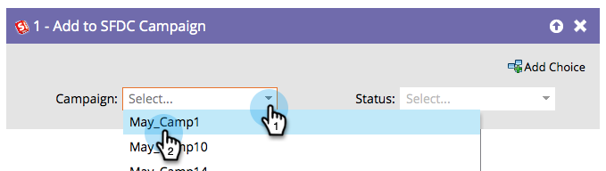

# SFDC 캠페인에 추가 {#add-to-sfdc-campaign}

이 흐름 단계는 Marketo Engage 캠페인에서 또는 Salesforce 캠페인에서 리드로서 사람을 추가하는 단일 흐름 단계로 사용할 수 있습니다. 잠재 고객이 Salesforce에 아직 존재하지 않는 경우 자동으로 동기화되어 지정된 상태의 캠페인에 추가됩니다.

>[!NOTE]
>
>Salesforce와 통합된 경우에만 사용할 수 있습니다.

## 사용량 {#usage}

1. 가망 고객을 추가할 Salesforce 캠페인을 찾아 선택합니다.

   

   >[!TIP]
   >
   >캠페인 목록에 Salesforce 캠페인이 표시되지 않는 경우:
   >
   >  1. [캠페인 동기화가 활성화되었는지 확인](/help/marketo/product-docs/crm-sync/salesforce-sync/setup/optional-steps/enable-disable-campaign-sync.md){target="_blank"}.
   >  1. [Marketo 동기화 사용자](/help/marketo/product-docs/crm-sync/salesforce-sync/setup/enterprise-unlimited-edition/step-2-of-3-create-a-salesforce-user-for-marketo-enterprise-unlimited.md){target="_blank"}가 Salesforce의 [마케팅 사용자](/help/marketo/product-docs/crm-sync/salesforce-sync/setup/optional-steps/enable-disable-campaign-sync/make-marketo-sync-user-a-marketing-user.md){target="_blank"}인지 확인하십시오.

   >[!TIP]
   >
   >Salesforce 캠페인 [내 토큰](/help/marketo/product-docs/core-marketo-concepts/programs/tokens/managing-my-tokens.md){target="_blank"}을(를) 사용하여 프로그램을 더 쉽게 복제할 수 있습니다.

1. Salesforce 캠페인 멤버 상태를 추가하여 잠재 고객에게 할당할 상태를 선택합니다.

   

   >[!CAUTION]
   >
   >사용자가 이미 Salesforce 캠페인의 리드 멤버인 경우 건너뛸 수 있으며 상태가 업데이트되지 않습니다. 대신 [SFDC 캠페인에서 상태를 변경](/help/marketo/product-docs/core-marketo-concepts/smart-campaigns/salesforce-flow-actions/change-status-in-sfdc-campaign.md){target="_blank"}할 수 있습니다.
