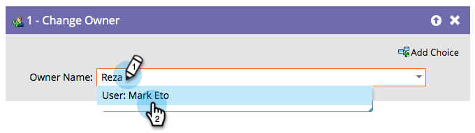

# 소유자 변경 {#change-owner}

이미 소유자에게 할당된 기존 인력이 있는 경우 이 흐름 단계를 사용하여 해당 인력을 다른 소유자에게 다시 할당할 수 있습니다.

1. 변경하려는 소유자 또는 잠재 고객 대기열을 선택하고 이동하기만 하면 됩니다.

   

   >[!CAUTION]
   >
   >Salesforce에서는 연락처가 리드 큐에 지정되는 것을 허용하지 않습니다. SFDC 담당자인 레코드의 경우:
   >
   >* 연락처가 Salesforce에 동기화되면 Marketo에서 중복 잠재 고객을 **만**&#x200B;합니다. 즉, `AssignTo=<a lead queue>`과(와) 함께 **[SFDC에 사용자 동기화](/help/marketo/product-docs/core-marketo-concepts/smart-campaigns/salesforce-flow-actions/sync-person-to-sfdc.md)** 흐름 단계를 사용하는 경우 Marketo은 Salesforce에서 중복 리드를 만들고 리드 큐에 할당합니다.
   >
   >* 연락처에서 **[!UICONTROL 소유자 변경]** 흐름 단계를 사용하는 경우 Marketo에서 Salesforce에 중복 리드를 만듭니다. 이 문제를 방지하려면 작업을 리드로만 제한하는 &#39;SFDC 유형&#39; 필드의 필터를 사용하십시오.

   >[!NOTE]
   >
   >레코드가 Salesforce 계정에 아직 없으면 동기화한 다음 선택한 사용자에게 할당합니다.
