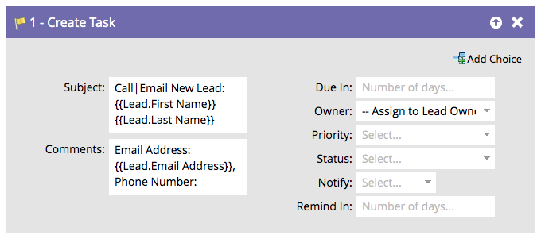

# 작업 만들기 {#create-task}

마케터는 거래 성사에 도움이 되는 정보를 보유하고 있습니다. 작업을 만들어 수행할 작업과 수행할 시기를 알릴 수 있습니다.

>[!NOTE]
>
>Marketo 동기화 사용자가 작업을 만들 때 **[!UICONTROL Due In]**&#x200B;은(는) Salesforce에서 작업을 만드는 데 필요한 필드입니다. Marketo은 값이 없는 경우 기본적으로 5일을 입력합니다.

기본적으로 흐름 단계는 다음과 같이 표시됩니다.

원하는 방식으로 작업을 만들려면 모든 필드를 사용자 지정합니다.

>[!TIP]
>
>**[!UICONTROL Subject]** 및 **[!UICONTROL Description]**&#x200B;에서 `{{lead.tokens}}`, `{{company.tokens}}`, `{{campaign.tokens}}` 및 `{{system.tokens}}`을(를) 사용할 수 있습니다. 자세한 내용은 [흐름 단계의 토큰](/help/marketo/product-docs/core-marketo-concepts/smart-campaigns/flow-actions/use-tokens-in-flow-steps.md){target="_blank"}을 참조하세요.
