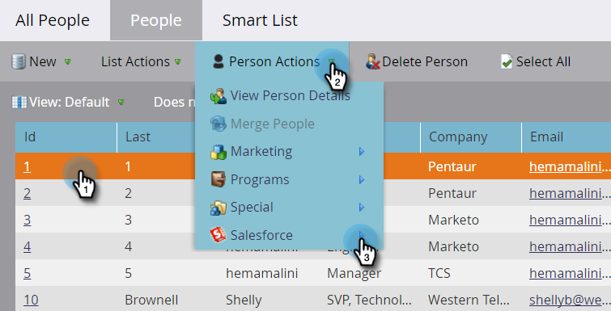

# SFDC에서 사용자 삭제 {#delete-person-from-sfdc}

Salesforce에서 특정 리드 세트를 제거해야 하지만 Marketo Engage에 있는 사용자로 남겨두어야 하는 경우 SFDC에서 개인 삭제 플로우 작업을 사용할 수 있습니다.

>[!NOTE]
>
>[!DNL Salesforce]과(와) 통합된 경우에만 사용할 수 있습니다.

1. 데이터베이스에서 Salesforce에서 제거할 사용자를 클릭합니다. **[!UICONTROL Person Actions]**&#x200B;을(를) 클릭하고 **[!DNL Salesforce]**&#x200B;을(를) 선택합니다.

   

1. **[!UICONTROL Delete Person from SFDC]**&#x200B;를 선택합니다.

   

1. **[!UICONTROL Delete in Marketo]** 설정이 **[!UICONTROL false]**&#x200B;인지 확인한 다음 **[!UICONTROL Run Now]**&#x200B;을(를) 클릭합니다.

   

   흐름 단계가 실행되면 사용자는 더 이상 [!DNL Salesforce]의 잠재 고객이 아니지만 Marketo에 남게 됩니다.

   >[!CAUTION]
   >
   >**[!UICONTROL Delete in Marketo]**&#x200B;을(를) **[!UICONTROL true]**(으)로 설정하고 Marketo의 직원과 Salesforce의 잠재 고객을 삭제하면 영구적으로 사라집니다. 이 작업은 취소할 수 없습니다.
