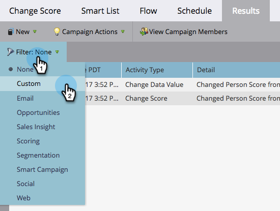

# 스마트 캠페인 결과 필터링 {#filter-smart-campaign-results}

>[!PREREQUISITES]
>
>[스마트 캠페인 결과 보기](/help/marketo/product-docs/core-marketo-concepts/smart-campaigns/smart-campaign-data/view-smart-campaign-results.md)

스마트 캠페인 결과를 필터링하여 중요한 특정 활동을 확인합니다.

## 저장된 필터로 필터링 {#filter-by-saved-filters}

1. Smart Campaign **[!UICONTROL 결과]** 탭에서 **[!UICONTROL 필터]**&#x200B;를 클릭하고 저장된 필터를 선택합니다.

   

   >[!NOTE]
   >
   >기본적으로 적용된 필터는 없으며 결과에 모든 활동이 표시됩니다.

## 사용자 지정 필터 만들기 {#create-a-custom-filter}

1. **[!UICONTROL 필터]**&#x200B;를 클릭한 다음 **[!UICONTROL 사용자 지정]**&#x200B;을 클릭합니다.

   

1. 표시할 활동 유형을 선택하고 **[!UICONTROL 다른 이름으로 저장]**&#x200B;을 클릭합니다.

   

   >[!TIP]
   >
   >사용자 지정 필터를 저장하지 않고 결과에 직접 적용하려면 **[!UICONTROL 적용]**&#x200B;을 클릭하십시오.

1. 필터 이름을 입력하고 **[!UICONTROL 저장]**&#x200B;을 클릭합니다.

   

1. 사용자 지정 필터는 결과에 적용되며, 이제 드롭다운에서 사용할 수 있습니다(드롭다운에서 보려면 페이지를 새로 고쳐야 할 수 있음).

   
