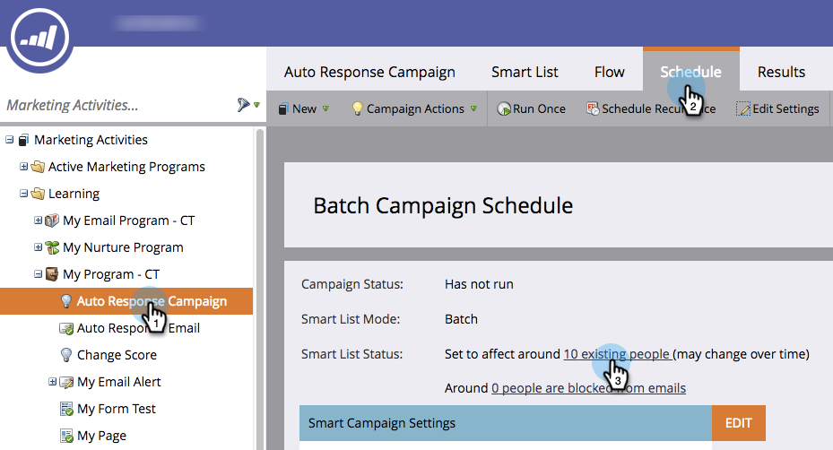

# 스마트 캠페인에서 자격이 있는 사람 보기 {#view-qualified-people-in-a-smart-campaign}

스마트 캠페인을 실행할 때 흐름을 경험할 수 있는 자격을 갖춘 사람을 볼 수 있습니다.

1. 스마트 캠페인에서 예약을 클릭합니다. 스마트 목록 상태에서 첫 번째 링크를 클릭합니다.

>[!NOTE]
>
>스마트 캠페인은 라이브 이벤트를 기반으로 실행되므로 자격이 있는 사람을 표시하지 않습니다.

1. 자격이 **있는 사람** 탭에는 캠페인이 실행될 때 흐름을 거칠 자격이 있는 사람이 나열됩니다.

   

   >[!CAUTION]
   >
   >자격이 있는 사람 목록은 차단된 사람 또는 통신 제한에 도달한 사람에 대해 설명하지 않습니다.

   >[!NOTE]
   >
   >자격 조건을 갖춘 사람의 수도 스마트 캠페인 자격 규칙에 따라 다릅니다. 자격 조건 규칙을 [편집하는 방법을 알아봅니다](../../../../product-docs/core-marketo-concepts/smart-campaigns/using-smart-campaigns/edit-qualification-rules-in-a-smart-campaign.md).

달콤해 이 목록을 사용하여 스마트 캠페인을 실행하기 전에 흐름을 거칠 수 있는 사람을 확인할 수 있습니다.

>[!NOTE]
>
>**관련 문서**
>
>* [스마트 캠페인 멤버 보기](view-smart-campaign-members.md)
>* [스마트 캠페인에서 차단된 사람 보기](view-blocked-people-in-a-smart-campaign.md)
>* [스마트 캠페인에 흐름 단계 추가](../../../../product-docs/core-marketo-concepts/smart-campaigns/flow-actions/add-a-flow-step-to-a-smart-campaign.md)

>

