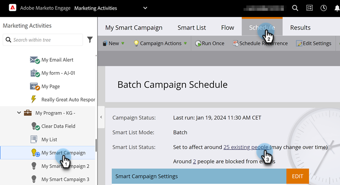

# 스마트 캠페인에서 적격 사용자 보기 {#view-qualified-people-in-a-smart-campaign}

Smart Campaign을 실행할 때 흐름을 진행할 자격이 있는 사용자를 봅니다.

1. 스마트 캠페인에서 **[!UICONTROL Schedule]** 탭을 클릭합니다. Smart List Status에서 첫 번째 링크를 클릭합니다.

>[!NOTE]
>
>트리거 캠페인은 라이브 이벤트를 기반으로 실행되므로 적격한 사람이 표시되지 않습니다.

1. **[!UICONTROL Qualified People]** 탭에는 캠페인이 실행될 때 흐름을 진행할 자격이 있는 사람이 나열됩니다.

   

   >[!CAUTION]
   >
   >자격 있는 사용자 목록은 차단된 사용자 또는 통신 제한에 도달한 사용자를 고려하지 않습니다.

   >[!NOTE]
   >
   >자격 있는 사람의 수도 스마트 캠페인 자격 규칙에 따라 다릅니다. [자격 규칙을 편집](/help/marketo/product-docs/core-marketo-concepts/smart-campaigns/using-smart-campaigns/edit-qualification-rules-in-a-smart-campaign.md){target="_blank"}하는 방법에 대해 알아보세요.

좋네! 이 목록을 사용하여 Smart Campaign을 실행하기 전에 흐름을 통과할 수 있는 사용자를 확인할 수 있습니다.

>[!MORELIKETHIS]
>
>* [스마트 캠페인 구성원 보기](/help/marketo/product-docs/core-marketo-concepts/smart-campaigns/smart-campaign-data/view-smart-campaign-members.md){target="_blank"}
>* [스마트 캠페인에서 차단된 사용자 보기](/help/marketo/product-docs/core-marketo-concepts/smart-campaigns/smart-campaign-data/view-blocked-people-in-a-smart-campaign.md){target="_blank"}
>* [스마트 캠페인에 흐름 단계 추가](/help/marketo/product-docs/core-marketo-concepts/smart-campaigns/flow-actions/add-a-flow-step-to-a-smart-campaign.md){target="_blank"}
