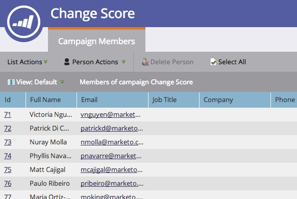

# 스마트 캠페인 멤버 보기 {#view-smart-campaign-members}

스마트 캠페인 흐름을 이미 거친 사용자를 봅니다.스마트한 캠페인 구성원

1. 마케팅 활동으로 이동합니다.

1. 스마트 캠페인에서 캠페인 구성원 보기를 클릭합니다.

   

>[!TIP]
>
>스마트 캠페인 내의 아무 곳에서나 캠페인 구성원을 볼 수 있습니다.

1. **캠페인 구성원** 탭은 스마트 캠페인 흐름을 이미 실행한 사람을 표시합니다.

   

   >[!NOTE]
   >
   >스마트 캠페인이 어떤 사람에서도 실행되지 않으면 처음에 캠페인 구성원 목록이 비어 있게 됩니다.

   >[!NOTE]
   >
   >**자세히 알아보기**
   >
   >
   >[lists](http://docs.marketo.com/display/docs/smart+lists+and+static+lists)로 수행할 수 있는 작업에 대해 자세히 알아보십시오.

   >[!NOTE]
   >
   >**관련 문서**
   >
   >    
   >    
   >    * [스마트 캠페인에서 차단된 사람 보기](view-blocked-people-in-a-smart-campaign.md)

