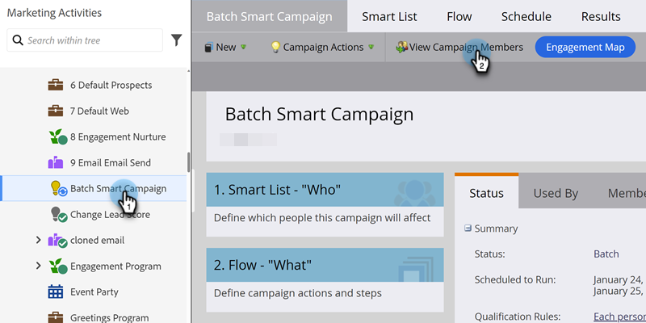

# 스마트 캠페인 멤버 보기 {#view-smart-campaign-members}

스마트 캠페인 플로우를 이미 통과한 사용자를 봅니다.

1. **[!UICONTROL Marketing Activities]** 으로 이동합니다.

   

1. 스마트 캠페인에서 **[!UICONTROL View Campaign Members]**&#x200B;을(를) 클릭합니다.

   

   >[!TIP]
   >
   >Smart Campaign 내의 어디에서든 캠페인 멤버를 볼 수 있습니다.

1. **[!UICONTROL Campaign Members]** 탭에는 스마트 캠페인 플로우를 이미 실행한 사용자가 표시됩니다.

   

   >[!NOTE]
   >
   >스마트 캠페인이 어떤 사용자에서도 실행되지 않은 경우 캠페인 멤버 목록은 처음에 비어 있습니다.

   >[!MORELIKETHIS]
   >
   >[스마트 캠페인에서 차단된 사용자 보기](/help/marketo/product-docs/core-marketo-concepts/smart-campaigns/smart-campaign-data/view-blocked-people-in-a-smart-campaign.md){target="_blank"}
