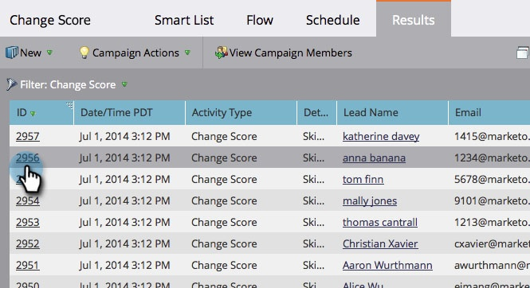

# 스마트 캠페인 결과 보기 {#view-smart-campaign-results}

스마트한 캠페인에서 발생한 모든 것의 분류를 보고 싶습니까? 간편한 방법

1. 스마트 캠페인에서 **결과**&#x200B;를 클릭합니다.

   >[!TIP]
   >
   >[캠페인 구성원 보기](/help/marketo/product-docs/core-marketo-concepts/smart-campaigns/smart-campaign-data/view-smart-campaign-members.md)를 클릭하여 스마트 캠페인에서 처리된 사람 목록을 볼 수 있습니다.

   

   >[!TIP]
   >
   >활동 유형을 기반으로 결과를 필터링할 수도 있습니다. [스마트 캠페인 결과 필터링 방법](/help/marketo/product-docs/core-marketo-concepts/smart-campaigns/smart-campaign-data/filter-smart-campaign-results.md)을 알아봅니다.

1. 특정 활동에 대한 자세한 내용을 보려면 **ID**&#x200B;을 클릭합니다.

   

   >[!TIP]
   >
   >개인 이름을 클릭하여 개인 세부 사항을 봅니다.

   결과를 분석하여 캠페인이 실제로 어떤 작업을 수행했는지 확인하거나 단순히 [스마트 캠페인 결과를 Excel](/help/marketo/product-docs/core-marketo-concepts/smart-campaigns/smart-campaign-data/export-smart-campaign-results-to-excel.md)로 내보냅니다.

   >[!MORELIKETHIS]
   >
   >[스마트 캠페인 결과 필터링](/help/marketo/product-docs/core-marketo-concepts/smart-campaigns/smart-campaign-data/filter-smart-campaign-results.md)
