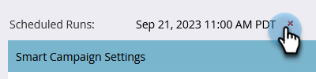

# 예약된 배치 캠페인 실행 취소 {#cancel-a-scheduled-batch-campaign-run}

배치 캠페인 중 하나에 대한 실행을 예약했으며 취소하려는 경우 방법은 다음과 같습니다.

1. 캠페인을 선택하고 **[!UICONTROL Schedule]** 탭으로 이동합니다.

   

1. 취소할 예약된 실행을 찾은 다음 그 옆에 있는 **x**&#x200B;을(를) 클릭합니다.

   

1. **[!UICONTROL OK]**&#x200B;을(를) 클릭하여 취소를 확인합니다.

   

>[!NOTE]
>
>실행이 이미 시작된 경우에는 이 작업을 수행해도 도움이 되지 않습니다. 나중에 실행을 취소해야 한다고 결정할 때 사용합니다.
