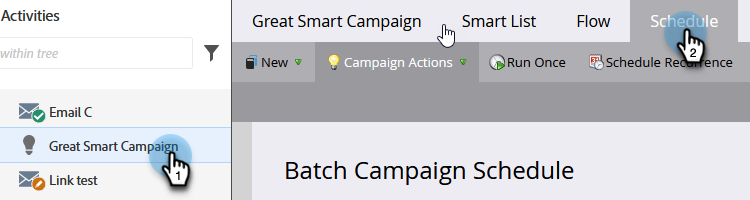

# 예약된 반복 배치 캠페인 실행 취소 {#cancel-a-scheduled-recurring-batch-campaign-run}

더 이상 원하지 않는 반복 배치 캠페인이 있는 경우 향후 실행을 취소할 수 있습니다. 방법은 다음과 같습니다.

1. 스마트 캠페인을 선택하고 **일정** 탭을 클릭합니다.

   

1. **반복 예약**&#x200B;을 클릭합니다.

   

   >[!TIP]
   >
   >옆에 있는 을 클릭하여 한 번의 실행을 취소할 수 있습니다. 예약된 일괄 캠페인 실행을 [취소](/help/marketo/product-docs/core-marketo-concepts/smart-campaigns/using-smart-campaigns/cancel-a-scheduled-batch-campaign-run.md){target="_blank"}하는 방법에 대해 알아봅니다.

1. 일정을 **[!UICONTROL 없음]**(으)로 설정하고 **[!UICONTROL 저장]**&#x200B;을 클릭합니다.

   

   짜잔! 스마트 캠페인이 더 이상 실행되지 않습니다.

   >[!CAUTION]
   >
   >이렇게 하면 향후 실행이 취소되지만, 스마트 캠페인이 실행 중인 경우 취소할 수 없습니다.

   >[!MORELIKETHIS]
   >
   >[예약된 일괄 캠페인 실행 취소](/help/marketo/product-docs/core-marketo-concepts/smart-campaigns/using-smart-campaigns/cancel-a-scheduled-batch-campaign-run.md){target="_blank"}
