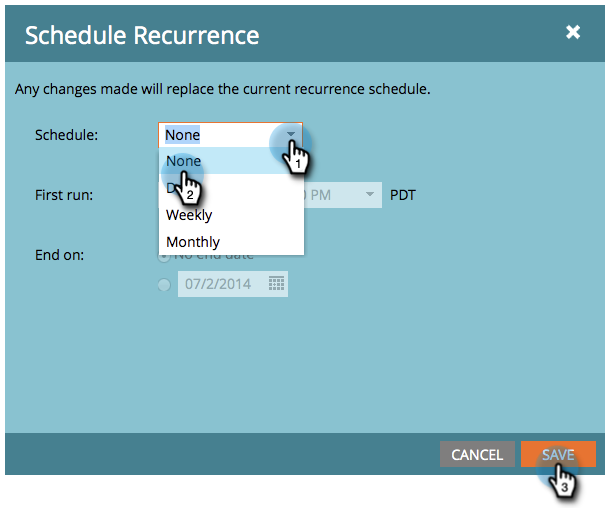

# 예약된 반복 배치 캠페인 실행 취소 {#cancel-a-scheduled-recurring-batch-campaign-run}

더 이상 원하지 않는 반복 배치 캠페인이 있는 경우 향후 실행을 취소할 수 있습니다. 방법

1. 스마트 캠페인을 클릭한 다음 **예약** 탭을 클릭합니다.

   

1. **예약** **되풀이**&#x200B;을 클릭합니다.

   

   >[!TIP]
   >
   >그 옆의 을 클릭하여 단일 실행을 취소할 수 있습니다. [예약된 배치 캠페인 실행을 취소하는 방법을 알아봅니다](cancel-a-scheduled-batch-campaign-run.md).

1. 예약을 **없음**&#x200B;으로 설정한 다음 **저장**&#x200B;으로 설정합니다.

   

   Voila! 스마트 캠페인은 더 이상 실행되지 않습니다.

   >[!CAUTION]
   >
   >이후 실행이 취소되지만 스마트 캠페인이 실행 중인 경우 취소할 수 없습니다.

   >[!NOTE]
   >
   >**관련 문서**
   >
   >    
   >    
   >    * [예약된 배치 캠페인 실행 취소](cancel-a-scheduled-batch-campaign-run.md)

