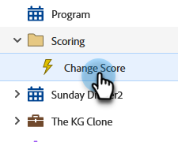

# 트리거 스마트 캠페인 비활성화 | 일정 탭 {#deactivate-a-trigger-smart-campaign-schedule-tab}

비활성화해야 하는 이전 트리거 캠페인이 있는 경우 다음 단계를 따르십시오.

1. 활성 트리거 캠페인을 찾아 선택합니다.

   

1. 예약 탭에서 **[!UICONTROL Deactivate]**&#x200B;을(를) 클릭합니다.

   

1. **[!UICONTROL Deactivate]**&#x200B;을(를) 클릭하여 확인합니다.

   

>[!NOTE]
>
>_새_&#x200B;명의 사용자가 흐름을 시작하지 못하지만 대기 단계나 다른 흐름 단계에 있는 사용자는 완료될 때까지 흐름을 계속 이동합니다.
