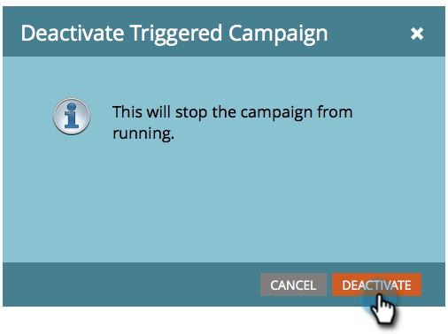

# 트리거 스마트 캠페인 비활성화 | 예약 탭 {#deactivate-a-trigger-smart-campaign-schedule-tab}

비활성화해야 하는 이전 트리거 캠페인이 있는 경우 다음 단계를 수행합니다.

1. 활성 트리거 캠페인을 찾아 선택합니다.

   

1. 예약 탭에서 비활성화를 클릭합니다.

   

1. 비활성화를 클릭하여 확인합니다.

   

>[!NOTE]
>
>이렇게 하면 *new*&#x200B;의 사용자가 흐름에 들어가지 못하지만, 대기 단계나 다른 흐름 단계에 있는 사람은 완료될 때까지 계속 흐름을 따라 이동하게 됩니다.

