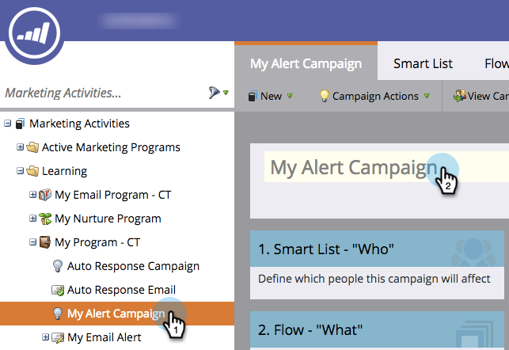

# 스마트 캠페인 이름 변경 {#rename-a-smart-campaign}

기존 스마트 캠페인의 이름을 변경할 수 있습니다. 방법

1. 마케팅 활동으로 이동합니다.

   

1. 스마트 캠페인을 선택한 다음 해당 이름을 클릭합니다.

   

   >[!TIP]
   >
   >프로그램 내의 스마트 캠페인 이름은 항상 &#39;ProgramName.CampaignName&#39; 형식으로 변환됩니다.

1. 새 스마트 캠페인 이름을 입력하고 저장을 클릭합니다.

   

   >[!NOTE]
   >
   >이전 이름은 탭에 표시되며 저장 시 변경됩니다.

빠르고 간편하게 스마트 캠페인이 참조되는 모든 곳도 변경됩니다.