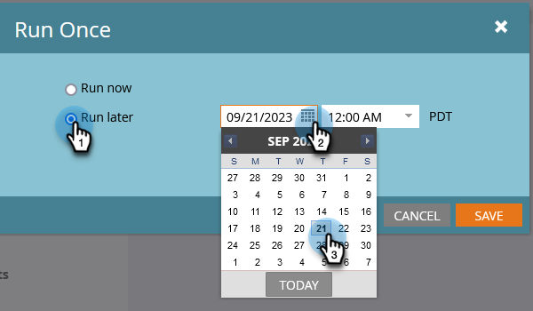

# 나중에 실행되도록 일괄 처리 스마트 캠페인 예약 {#schedule-a-batch-smart-campaign-to-run-later}

미래의 어느 시점에 실행되도록 일괄 처리 캠페인을 설정하려면 다음 방법을 참조하십시오.

>[!TIP]
>
>다음을 수행할 수도 있습니다. [프로그램 일정 보기에서 배치 스마트 캠페인 일정 조정](/help/marketo/product-docs/core-marketo-concepts/programs/program-schedule-view/reschedule-a-batch-smart-campaign-in-the-program-schedule-view.md){target="_blank"}.

1. 실행할 일괄 처리 스마트 캠페인을 선택하고 **[!UICONTROL 예약]** 탭을 클릭하고 다음을 클릭합니다. **[!UICONTROL 한 번 실행]**.

   

1. 클릭 **[!UICONTROL 나중에 실행]**&#x200B;그런 다음 달력 아이콘을 클릭하고 스마트 캠페인을 실행할 날짜를 선택합니다.

   

1. 스마트 캠페인을 실행할 시간을 선택합니다(최소 15분 전).

   

1. **[!UICONTROL 저장]**&#x200B;을 클릭합니다.

   

1. 다음을 확인하여 예약된 실행을 확인할 수 있습니다. **[!UICONTROL 예약]** 탭.

   

   >[!NOTE]
   >
   >[반복 배치 캠페인 예약](/help/marketo/product-docs/core-marketo-concepts/smart-campaigns/using-smart-campaigns/schedule-a-recurring-batch-campaign.md){target="_blank"}
