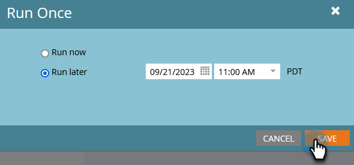

# 배치 스마트 캠페인 나중에 실행하도록 예약 {#schedule-a-batch-smart-campaign-to-run-later}

미래의 어느 시점에 실행되도록 일괄 처리 캠페인을 설정하려면 다음 방법을 참조하십시오.

>[!TIP]
>
>[프로그램 일정 보기에서 일괄 처리 스마트 캠페인을 다시 예약](/help/marketo/product-docs/core-marketo-concepts/programs/program-schedule-view/reschedule-a-batch-smart-campaign-in-the-program-schedule-view.md){target="_blank"}할 수도 있습니다.

1. 실행할 일괄 처리 스마트 캠페인을 선택하고 **[!UICONTROL Schedule]** 탭으로 이동한 다음 **[!UICONTROL Run Once]**&#x200B;을(를) 클릭합니다.

   

1. **[!UICONTROL Run later]**&#x200B;을(를) 클릭한 다음 달력 아이콘을 클릭하고 스마트 캠페인을 실행할 날짜를 선택합니다.

   

1. 스마트 캠페인을 실행할 시간을 선택합니다(최소 15분 전).

   

1. **[!UICONTROL Save]**&#x200B;를 클릭합니다.

   

1. **[!UICONTROL Schedule]** 탭에서 예약된 실행을 확인할 수 있습니다.

   

   >[!NOTE]
   >
   >[반복 일괄 처리 캠페인 예약](/help/marketo/product-docs/core-marketo-concepts/smart-campaigns/using-smart-campaigns/schedule-a-recurring-batch-campaign.md){target="_blank"}
