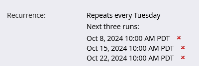

# 반복 배치 캠페인 예약 {#schedule-a-recurring-batch-campaign}

반복을 사용하면 배치 캠페인을 정기적으로 실행할 수 있습니다. 예를 들어 일주일에 한 번, 화요일 오전 10시.

1. 스마트 캠페인을 선택하고 **[!UICONTROL 예약]** 탭을 클릭하고 다음을 클릭합니다. **[!UICONTROL 반복 예약]**.

   

1. 다음을 클릭합니다. **[!UICONTROL 예약]** 드롭다운 및 선택 **[!UICONTROL 매주]**.

   

1. 달력 아이콘을 클릭하고 첫 번째 실행에 원하는 날짜를 선택합니다.

   

1. 실행해야 하는 시간을 선택합니다.

   

1. 나가기 &quot;[!UICONTROL 반복 간격]&quot;1로 화요일 을 선택하고 **[!UICONTROL 저장]**.

   

   >[!NOTE]
   >
   >특정 실행 길이의 경우 옆에 있는 달력 아이콘을 클릭할 수 있습니다 **[!UICONTROL 종료 일자]** 종료 날짜를 선택합니다.

예약된 반복은 [예약] 탭의 맨 아래에 표시됩니다.

>[!NOTE]
>
>예약 탭에는 참조할 다음 세 가지 항목이 표시됩니다. 빨간색 클릭 **X** 이(가) 특정 실행을 취소합니다.
