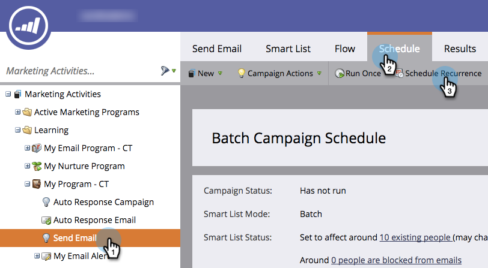

# 반복 배치 캠페인 예약 {#schedule-a-recurring-batch-campaign}

반복을 사용하면 정기적으로 일괄 스마트 캠페인을 실행할 수 있습니다. 예 - 일주일에 한 번, 월요일 오후 12:00입니다.

1. 캠페인을 선택하고 예약 탭으로 이동한 다음 되풀이 예약을 클릭합니다.

   

1. 예약 드롭다운을 클릭하고 주간을 선택합니다.

   

1. 달력 아이콘을 클릭하고 첫 번째 실행 날짜를 선택합니다. 이 예에서는 다음 주 월요일에 사용 가능합니다.

   

1. 실행할 시간을 선택합니다.

   

1. 반복을 1로 유지하고 월요일을 선택하고 저장을 클릭합니다.

   

1. 예약 탭 아래에 예약된 반복이 표시되어 유효성을 확인할 수 있습니다.

   

>[!NOTE]
>
>예약 탭에는 참조의 다음 세 항목이 표시됩니다.

그게 다야! 이제 일괄 처리 캠페인은 매주 월요일 정오에 실행됩니다.