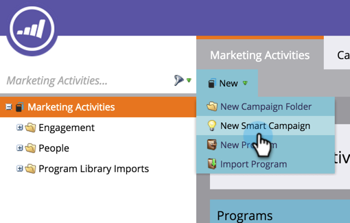

# &quot;캠페인이 요청됨&quot;을 사용하여 영업을 위한 트리거 스마트 캠페인 설정 {#setting-up-a-trigger-smart-campaign-for-sales-using-campaign-is-requested}

Marketing의 가장 멋진 기능 중 하나는 세일즈 사용자가 마케팅 활동에 참여할 수 있도록 하는 기능입니다. 그들은 사람들과 교류하며 최전선에 있습니다. 세일즈 담당자는 올바른 방향으로 마케팅을 전개할 수 있어야 합니다.

>[!NOTE]
>
>**예**
>
>요청할 스마트 캠페인의 예:
>
>1. **장기교육** - 그들이 올해 예산을 가지고 있지 않고 당신은 그저 레이더에 있고 싶을 때
>1. **활성 판매 주기** - 판매자가 자신의 메시지를 제외한 다른 사람에게 메시지를 원하지 않을 때 (마케팅 일시 중단 플래그를 사용하여 일시적으로 구독 취소)

>
>
창의적인 아이디어 표현 영업부 직원은 어떤 작업을 자동화하고 싶습니까? 그들에게 물어보고 전신시켜라!

1. 스마트 **캠페인 만들기를 참조하십시오.**

   

1. Campaign을 찾아 **Requested** ** **** 캔버스**로 드래그합니다.

   

1. 소스 선택 사항은 어떤 유형의 요청이 적용되는지를 나타냅니다. Salesforce 기능의 경우 **Sales** Insight를 선택해야 **합니다**.

   >[!TIP]
   >
   >소스 연산자는 보안을 위한 것입니다. 다른 스마트 캠페인 또는 개발자와 같이 특정 소스에서만 수행하는 요청으로 캠페인을 제한할 수 있습니다. 모든 소스 **의 요청을** 허용하려면 첫 번째 상자에서 [모두 포함]을 선택합니다.
   >
   >
   >**Sales Insight를 선택하면 영업 상자 안에 마법처럼 나타납니다**. 너무 무리하지 마세요. 너무 많은 사람들이 그들에게 무시될 것이다.

   

마케팅 활동을 다른 부서로 확대하기 위한 좋은 방법입니다. 모든 유형의 캠페인을 자동화할 수 있습니다.

>[!TIP]
>
>스마트한 캠페인 이름을 명확하게 지정하는 것을 잊지 마십시오. 이름을 정확하게 지정하는 방법을 Sales Insight에 확인할 수 있습니다.

