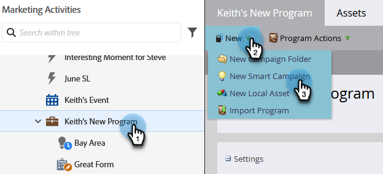

# “캠페인 요청됨”을 사용하여 영업용 트리거 스마트 캠페인 설정 {#setting-up-a-trigger-smart-campaign-for-sales-using-campaign-is-requested}

Marketo의 가장 멋진 기능 중 하나는 영업 사원이 마케팅 활동에 참여할 수 있도록 하는 기능입니다. 그들은 최전선에 있고, 사람들과 교류하고 있습니다. Sales Rep 는 올바른 방향으로 마케팅을 제어할 수 있어야 합니다.

>[!NOTE]
>
>요청할 스마트 캠페인의 예:
>
>1. **장기 육성** - 올해 예산이 없어 미해결 상태로 유지하려는 경우
>1. **활성 영업 주기** - 영업 사원이 자신의 영업 사원을 제외한 다른 영업 사원에게 메시지를 보내지 않으려는 경우. (일시적으로 가입을 해지하려면 마케팅 일시 중단 플래그를 사용합니다.)
>
>영업팀에 자동화할 내용을 물어보고 설정합니다.

1. 스마트 캠페인을 만듭니다.

   

1. **[!UICONTROL Campaign is Requested]** 트리거를 찾아 캔버스로 드래그합니다.

   

1. 소스 선택 사항은 어떤 종류의 요청을 수행할 것인지 나타냅니다. Salesforce 기능을 사용하려면 **[!UICONTROL Sales Insight]**&#x200B;을(를) 선택하십시오.

   >[!TIP]
   >
   >소스 연산자는 보안을 위한 것입니다. 다른 스마트 캠페인 또는 개발자와 같이 특정 소스에서만 수행된 요청으로 캠페인을 제한할 수 있습니다. 모든 원본의 요청을 허용하려면 첫 번째 상자에서 **[!UICONTROL Is Any]**&#x200B;을(를) 선택하십시오.
   >
   >_기억하기_, 판매 Insight을 선택하면 판매 상자에 표시됩니다. 너무 많이 추가하지 마십시오. 무시되기 때문입니다.

   

마케팅 범위를 다른 부서로 확장하는 좋은 방법입니다. 자동화할 모든 종류의 캠페인을 설정합니다.

>[!TIP]
>
>스마트 캠페인의 이름을 명확히 지정합니다. 이 이름은 Sales Insight에 이름 지정 방식을 정확하게 보여 줍니다.
