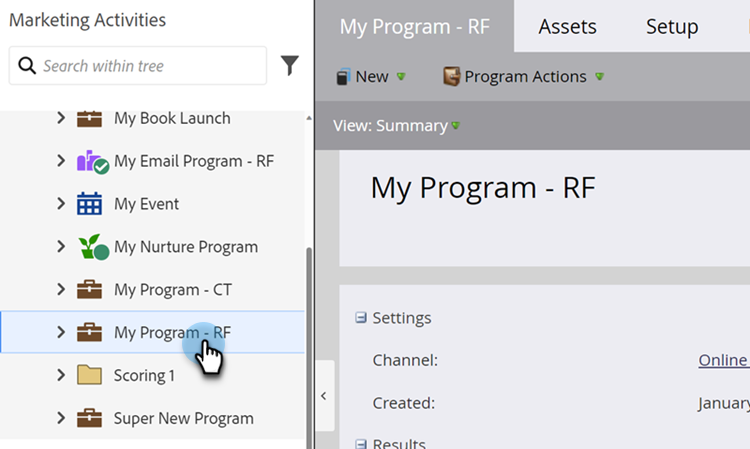

# 스마트 목록 만들기 {#create-a-smart-list}

스마트 목록을 사용하면 간단한 필터를 사용하여 특정 사용자 그룹을 찾을 수 있습니다. 만드는 방법은 다음과 같습니다.

1. **[!UICONTROL 마케팅 활동]**(으)로 이동합니다.

   

1. 에서 스마트 목록을 만들 프로그램을 선택합니다.

   

1. **[!UICONTROL 새로 만들기]**&#x200B;에서 **[!UICONTROL 새 로컬 자산]**&#x200B;을 클릭합니다.

   

1. **[!UICONTROL 스마트 목록]**&#x200B;을 선택하세요.

   

1. **[!UICONTROL 이름]**&#x200B;을(를) 입력하고 **[!UICONTROL 만들기]**&#x200B;를 클릭합니다.

   

   짜잔, 수고했어! 이제 몇 가지 필터를 추가하고 정의하겠습니다.

   >[!MORELIKETHIS]
   >
   >[스마트 목록에 필터 찾기 및 추가](/help/marketo/product-docs/core-marketo-concepts/smart-lists-and-static-lists/creating-a-smart-list/find-and-add-filters-to-a-smart-list.md){target="_blank"}
