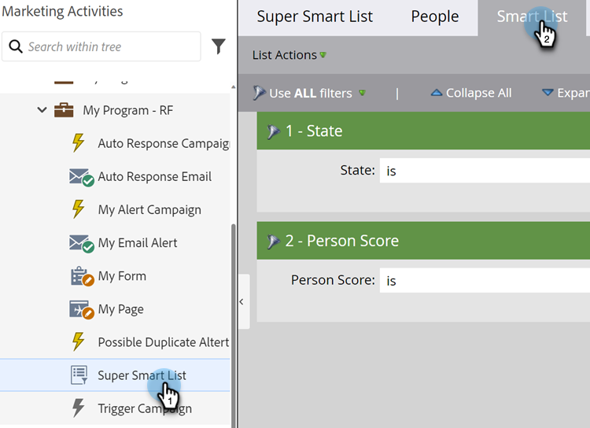

# 스마트 목록 필터 정의 {#define-smart-list-filters}

>[!PREREQUISITES]
>
>* [스마트 목록 만들기](/help/marketo/product-docs/core-marketo-concepts/smart-lists-and-static-lists/creating-a-smart-list/create-a-smart-list.md){target="_blank"}
>* [스마트 목록에 필터 찾기 및 추가](/help/marketo/product-docs/core-marketo-concepts/smart-lists-and-static-lists/creating-a-smart-list/find-and-add-filters-to-a-smart-list.md){target="_blank"}

이제 [스마트 목록을 만들고](/help/marketo/product-docs/core-marketo-concepts/smart-lists-and-static-lists/creating-a-smart-list/create-a-smart-list.md){target="_blank"}에 [필터를 추가](/help/marketo/product-docs/core-marketo-concepts/smart-lists-and-static-lists/creating-a-smart-list/find-and-add-filters-to-a-smart-list.md){target="_blank"}했으므로 필터를 정의해 보겠습니다. 방법은 다음과 같습니다.

계속해서 예를 들어 캘리포니아에 있는 점수가 50이 넘는 모든 사람을 찾기 위해 이러한 필터를 정의해 보겠습니다.

1. **[!UICONTROL Marketing Activities]**(으)로 이동합니다.

   

1. 원하는 스마트 목록을 선택하고 **[!UICONTROL Smart List]** 탭을 클릭합니다.

   

1. **[!UICONTROL State]** 필터에 대해 &quot;CA&quot;를 찾아 선택합니다.

   

   >[!NOTE]
   >
   >&quot;California&quot;와 &quot;CA&quot;를 모두 저장하고 있을 수 있습니다. 두 값을 필터링하고 캘리포니아에서 온 _모두_&#x200B;명을 포함하려면 [스마트 목록 필터에 여러 값을 추가](/help/marketo/product-docs/core-marketo-concepts/smart-lists-and-static-lists/using-smart-lists/add-multiple-values-to-a-smart-list-filter.md){target="_blank"}하는 방법에 대해 알아보세요.

1. **[!UICONTROL greater than]** 연산자를 선택하고 &quot;50&quot;을 입력하십시오.

   

>[!TIP]
>
>데이터베이스에 불완전한 이메일 주소가 포함된 일부 레코드가 있을 수 있다고 생각되면(예: &quot;@adobe.com&quot;) &quot;포함&quot; 연산자를 사용할 때 두 개의 이메일 주소 필터를 사용합니다. &quot;contains @adobe.com&quot;가 있는 필터 하나와 &quot;contains adobe.com&quot;이 있는 필터 하나 (@ 기호 제외).

이제 스마트 목록을 만들고 필터를 추가/정의하는 방법을 알 수 있습니다.
