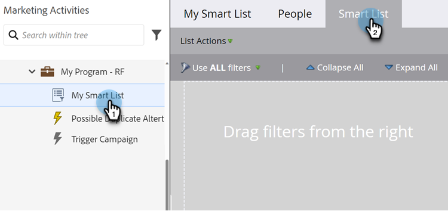
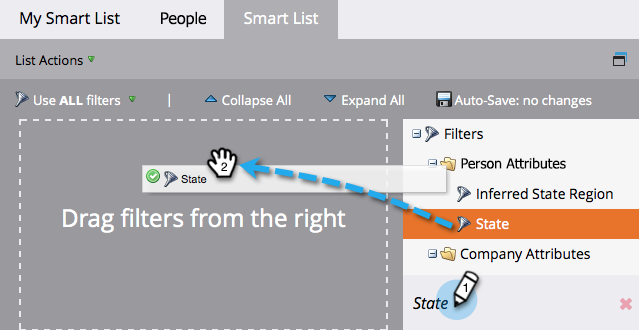

# 스마트 목록 필터 찾기 및 추가 {#find-and-add-filters-to-a-smart-list}

[스마트 목록을 만든](/help/marketo/product-docs/core-marketo-concepts/smart-lists-and-static-lists/creating-a-smart-list/create-a-smart-list.md){target="_blank"}후에는 및 [정의](/help/marketo/product-docs/core-marketo-concepts/smart-lists-and-static-lists/creating-a-smart-list/define-smart-list-filters.md){target="_blank"}하는 필터를 추가해야 합니다. 필터를 찾고 추가하는 방법은 다음과 같습니다.

이 예에서는 캘리포니아에 있는 점수가 50이 넘는 모든 사람을 찾아보겠습니다.

>[!TIP]
>
>오른쪽 트리 탐색 - 필터는 매우 강력하고 다양한 가능한 기능을 제공합니다.

1. **[!UICONTROL 마케팅 활동]**(으)로 이동합니다.

   

1. 필터를 추가할 스마트 목록을 선택하고 **[!UICONTROL 스마트 목록]** 탭을 클릭합니다.

   

1. **[!UICONTROL 상태]** 필터를 찾아 캔버스로 끕니다.

   

1. **[!UICONTROL 점수]** 필터도 찾아 끕니다.

   

완벽해! 이제 이러한 필터를 정의해 보겠습니다.

>[!MORELIKETHIS]
>
>* [스마트 목록 만들기](/help/marketo/product-docs/core-marketo-concepts/smart-lists-and-static-lists/creating-a-smart-list/create-a-smart-list.md){target="_blank"}
>* [스마트 목록 필터 정의](/help/marketo/product-docs/core-marketo-concepts/smart-lists-and-static-lists/creating-a-smart-list/define-smart-list-filters.md){target="_blank"}
