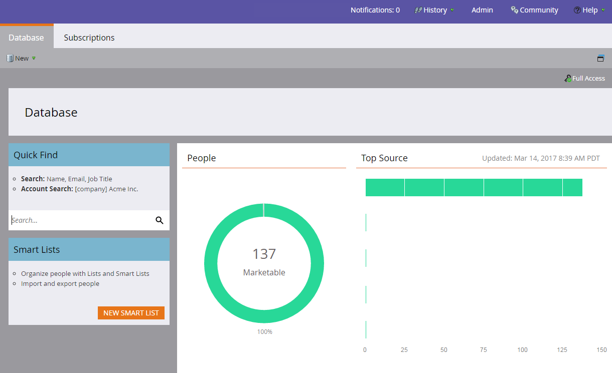

# 데이터베이스 대시보드 {#database-dashboard}

데이터베이스 대시보드는 작업 공간 내에서 사용자에 대한 주요 속성을 빠르게 판별하는 데 도움이 되는 스냅샷 역할을 합니다.

>[!NOTE]
>
>각 작업 영역에는 자체 데이터베이스가 있습니다.

홈 화면에서 **데이터베이스** 타일을 클릭하면 됩니다.   

또는 Marketing 로고를 클릭하고 데이터베이스를 **선택합니다**.

이 그래프에는 총 사용자 수, 마케팅 가능한 사람 수 및 상위 5명의 인득 소스를 보여줍니다.

>[!TIP]
>
>사용자에 대한 보다 구체적이거나 시기적절한 정보를 얻고자 하십니까? 사람 [성과 보고서를 사용해 보십시오](../../../../product-docs/reporting/basic-reporting/report-types/people-performance-report.md).

**총 사용자 수:** 해당 작업 영역에 대한 전체 사람 수입니다.  **마케팅 가능한 사람:** 작업 영역에 대한 전체 시간 사람 수( *다음을 제외)*:이메일 주소가 없는 사람, 이메일이 많이 반송된 사람, 구독 취소된 사람, 차단 목록에 추가된 현재 마케팅 일시 중단으로 설정된 사람.

