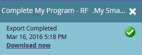

# 목록 또는 스마트 목록에서 사용자를 Excel로 내보내기 {#export-people-to-excel-from-a-list-or-smart-list}

Marketing To 외부에서 목록 또는 스마트 목록 결과가 필요한 경우 Excel로 쉽게 내보낼 수 있습니다. 방법

1. **마케팅 활동**&#x200B;으로 이동합니다.

   

1. 내보낼 목록 또는 스마트 목록을 선택하고 **사람** 탭으로 이동합니다.

   

1. 페이지 아래쪽에서 Excel 아이콘을 클릭합니다.

   

1. **보이는 열**&#x200B;을 선택하고 **내보내기**&#x200B;를 클릭합니다.

   

   >[!NOTE]
   >
   >**모든 열**&#x200B;을 선택하면 내보내기 크기가 더 커지고 생성/다운로드하는 데 시간이 더 걸립니다.

   >[!TIP]
   >
   >사람 레코드에 내보내기 시 제대로 렌더링되지 않는 외부 문자가 포함되어 있는 경우 **형식** 드롭다운에서 파일 유형을 변경해 보십시오.

1. 내보내기가 실행됩니다. 완료되면 **지금 다운로드**&#x200B;를 클릭하여 파일을 가져올 수 있습니다.

   

   >[!TIP]
   >
   >내보내기 시간이 오래 걸리면 언제든지 로그아웃했다가 나중에 다시 가져올 수 있습니다. **지금 다운로드** 링크는 **목록 작업** 메뉴에서 **내보내기 상태 표시**&#x200B;를 선택하여 액세스할 수 있으며 1주일 동안 유효합니다.

   스마트 목록을 Excel로 내보내면 Marketing Cloud에서 목록을 자동으로 캐시합니다. 다음에 로그인하거나 브라우저를 새로 고칠 때 스마트 목록 아이콘에 작은 종이 클립과 스티커 노트가 표시됩니다.

   

   >[!TIP]
   >
   >목록의 새로 고침 단추를 간단히 눌러 목록의 캐싱을 실행 취소할 수 있습니다.

