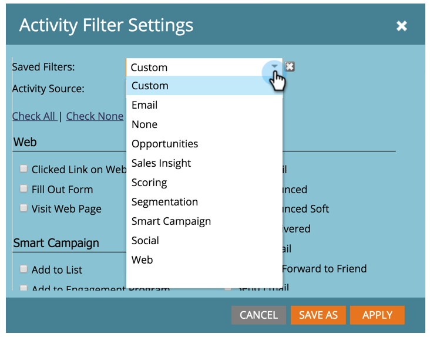

# 개인의 활동 로그에서 활동 유형 필터링 {#filter-activity-types-in-the-activity-log-of-a-person}

활동 로그에서 가장 중요한 활동을 검색합니다.

>[!NOTE]
>
>[활동 로그](/help/marketo/product-docs/core-marketo-concepts/smart-lists-and-static-lists/managing-people-in-smart-lists/locate-the-activity-log-for-a-person.md){target="_blank"}에 대해 자세히 알아보세요.

1. 개인 세부 정보 페이지로 이동합니다. **[!UICONTROL 활동 로그]** 탭을 클릭합니다.

   

1. **[!UICONTROL 필터]** 드롭다운을 선택합니다.

   

## 맞춤형 필터 만들기 {#creating-custom-filters}

1. **[!UICONTROL 필터]** 드롭다운을 클릭합니다. **[!UICONTROL 사용자 지정]**&#x200B;을 선택합니다.

   

1. 필터링 기준으로 사용할 활동을 선택하십시오. **[!UICONTROL 다른 이름으로 저장]**&#x200B;을 클릭합니다.

   

1. **[!UICONTROL 사용자 지정 필터 이름]**&#x200B;을 입력하십시오. **[!UICONTROL 저장]**&#x200B;을 클릭합니다.

   

   이제 필터의 기준을 충족하는 개인 활동만 표시됩니다.

   

## 저장된 필터 참조 {#reference-saved-filters}

저장된 필터는 [!UICONTROL 필터] 드롭다운에서 액세스할 수 있습니다.

1. **[!UICONTROL 필터]** 드롭다운을 클릭합니다. **[!UICONTROL 사용자 지정]**&#x200B;을 선택합니다.

   

1. **[!UICONTROL 저장한 필터]**&#x200B;를 클릭합니다. 저장된 필터 목록은 다음과 같습니다.

   
