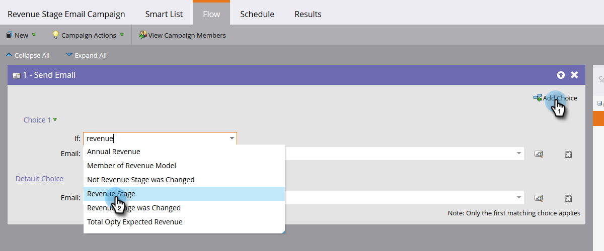

# 매출 단계에서 모든 사람 찾기 {#find-all-people-in-a-revenue-stage}

>[!PREREQUISITES]
>
>[스마트 목록 만들기](/help/marketo/product-docs/core-marketo-concepts/smart-lists-and-static-lists/creating-a-smart-list/create-a-smart-list.md)

## 특정 수익 단계의 모든 멤버 찾기 {#find-all-members-of-a-specific-revenue-stage}

1. 스마트 목록에서 **Smart List** 탭에서 **매출 단계** 필터링하고 캔버스로 드래그합니다.

   

1. 선택 **매출 단계**.

   

1. 로 이동합니다. **사람** 탭을 클릭하여 결과를 확인합니다.

   

## 매출 단계 구성원의 흐름 단계 실행 {#run-a-flow-step-on-the-members-of-a-revenue-stage}

이제 어느 사람들이 수익을 올리고 있는지 알고 있기 때문에 직접 마케팅할 수 있습니다. 선택할 것 외에도 **매출 단계** 스마트 목록 필터로, 흐름에서 &quot;if&quot; 필터로 선택할 수도 있습니다.

1. 원하는 흐름 단계에서 을 클릭합니다 **선택 추가** 을(를) 선택합니다. **매출 단계** 드롭다운

   

   여기에서 흐름 단계의 어느 측면에 영향을 받는 멤버를 선택할 수 있습니다. 재밌어!
