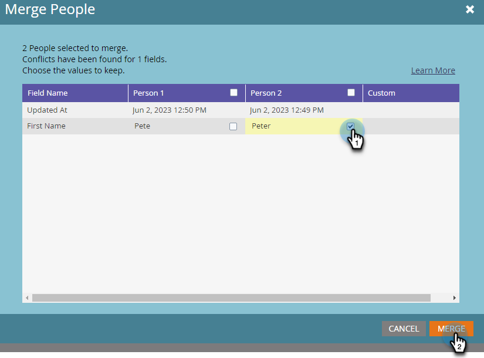

# 중복 사용자 찾기 및 병합 {#find-and-merge-duplicate-people}

Marketo Engage은 새로운 사용자가 시스템에 들어오면 자동으로 중복 제거를 수행합니다. 그러나 처음에 CRM에서 중복을 보냈을 수 있습니다. 결합 방법은 다음과 같습니다.

>[!CAUTION]
>
>사람을 병합하는 것은 영구적이므로 &quot;실행 취소&quot; 옵션이 없습니다.

>[!PREREQUISITES]
>
>중복 항목을 찾아서 병합하려면 [기본 제공/시스템 스마트 목록](/help/marketo/product-docs/core-marketo-concepts/smart-lists-and-static-lists/using-smart-lists/use-built-in-system-smart-lists.md){target="_blank"}을 사용해야 합니다.

>[!NOTE]
>
>Marketo은 [!DNL Salesforce] 또는 [!DNL Microsoft Dynamics] 동기화에 대해 자동으로 중복 제거가 수행되지 않으며 수동으로 사람을 입력해도 중복 제거되지 않습니다.

## 중복 항목 찾기 {#find-duplicates}

1. **[!UICONTROL Database]** 영역으로 이동합니다.

   

   >[!CAUTION]
   >
   >[!DNL Salesforce] 개인 계정을 사용하는 경우 Marketo에서 사용자 병합이 작동하지 않을 수 있습니다. 가능하면 [!DNL Salesforce]의 레코드를 병합하십시오.

1. **[!UICONTROL Possible Duplicates]** 시스템 스마트 목록을 선택하고 **[!UICONTROL People]** 탭을 클릭합니다.

   

   >[!NOTE]
   >
   >[사용자 지정 논리로 중복된 사람을 찾을 수 있습니다](/help/marketo/product-docs/core-marketo-concepts/smart-lists-and-static-lists/managing-people-in-smart-lists/find-duplicate-people-with-custom-logic.md){target="_blank"}.

## 수동으로 사람 병합 {#merge-people-manually}

>[!CAUTION]
>
>사용자를 병합할 때 손실되는 사용자에게 Marketo 사용자 지정 개체가 있는 경우 _그렇지 않음_&#x200B;이(가) 우승한 사용자에게 다시 연결됩니다. 병합을 수행하기 전에 사용자 지정 개체의 상위 항목을 다시 지정하십시오.

1. Ctrl/Cmd를 누른 채 클릭하여 중복 항목을 선택한 다음 **[!UICONTROL Merge People]**&#x200B;을(를) 클릭합니다.

   

   >[!TIP]
   >
   >동일한 사용자에 대해 두 개 이상의 중복 항목을 가질 수 있습니다. 모두 한 번에 선택하십시오.

1. _일치하지 않는_ 레코드 사이의 값이 표시됩니다. 각 필드에 유지할 값을 선택합니다. 완료되면 **[!UICONTROL Merge]**&#x200B;을(를) 클릭합니다. 둘 중 어느 값도 원하지 않는 경우 **[!UICONTROL Custom]**&#x200B;을(를) 확인하고 원하는 값을 입력할 수 있습니다.

   

   >[!NOTE]
   >
   >수동으로 사람을 병합하는 경우 처음 선택한 사람이 &quot;우승자&quot;가 됩니다. 따라서 사람 탭에서 레코드 ID 198과 199를 병합하고 먼저 199를 클릭하면 199가 병합된 사람의 레코드 ID가 됩니다. 두 개 이상의 레코드가 병합되는 경우에도 적용됩니다.

   >[!TIP]
   >
   >병합하는 것이 삭제하는 것보다 낫습니다. 모든 기록(페이지 방문, 링크 클릭, 이메일 열기, 양식 채우기 등)을 보존합니다.

## Salesforce의 효과 {#effect-in-salesforce}

Salesforce 통합이 있는 경우 Salesforce의 리드 병합 효과에 대한 몇 가지 사항이 있습니다.

* 리드만 병합하거나 연락처만 병합하는 경우 일반 [!DNL Salesforce] 규칙별로 병합됩니다.
* 리드와 연락처를 함께 병합하면 일반 [!DNL Salesforce] 규칙별로 병합하기 전에 모든 리드가 연락처로 변환됩니다.

잠재 고객 또는 연락처를 병합할 때 Salesforce 동작을 자세히 알아보려면 다음 [!DNL Salesforce] 문서를 확인하십시오.

* [중복 잠재 고객 병합](https://help.salesforce.com/HTViewHelpDoc?id=leads_merge.htm&language=en_US){target="_blank"}
* [중복된 연락처 병합](https://help.salesforce.com/HTViewHelpDoc?id=contacts_merge.htm&language=en_US){target="_blank"}

## 벌크 병합 {#bulk-merging}

중복 항목이 너무 많아 수동으로 병합할 수 없는 경우 Adobe 계정 팀(계정 관리자)에 문의하여 옵션에 대해 논의하십시오.
