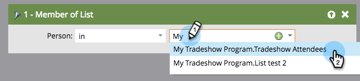

# 스마트 목록 {#use-members-of-list-in-a-smart-list}의 목록 멤버 사용

>[!TIP]
>
>[가져오기](../../../../getting-started/quick-wins/import-a-list-of-people.md) 또는 [목록 흐름 단계](../../../../product-docs/core-marketo-concepts/smart-campaigns/flow-actions/add-to-list.md)를 사용하여 목록에 사람을 추가할 수 있습니다.

이 필터를 사용하면 스마트 목록 규칙에서 해당 필터를 참조하여 다른 목록에서 구성원을 가져올 수 있습니다. 방법

1. 스마트 목록을 선택하고 **스마트 목록** 탭을 클릭합니다.

   

1. 오른쪽 필터 패널에서 **목록 구성원** 필터를 검색하여 캔버스로 드래그합니다.

   

1. 드롭다운 또는 유형을 클릭하여 스마트 목록에 포함할 목록을 검색합니다.

   

   **완료!** 이 예에서 스마트 목록은 이제 해당 목록의 멤버만 타깃팅하고 사용자가 포함하는 다른 규칙을 기반으로 평가합니다.

