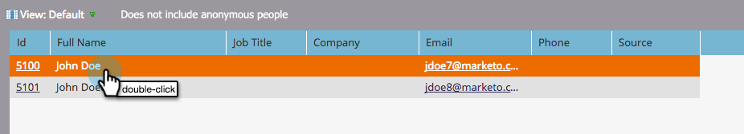

# 개인 세부 사항 페이지 사용 {#using-the-person-detail-page}

개인 세부 사항 페이지에는 Marketing에서 개인에 대해 알고 있는 모든 정보가 들어 있습니다. 이 페이지에서 직접 데이터를 편집할 수 있습니다.

## 개인 상세 정보 페이지 {#getting-to-person-detail-page} 가져오기

특정한 사람들을 여는 많은 방법들이 있다. 다음은 몇 가지 예입니다.

>[!NOTE]
>
>**예**
>
>* **데이터베이스**&#x200B;에서 빠른 찾기에서 검색할 수 있습니다
>* 모든 스마트 **목록** 또는 목록
>* **프로그램** 멤버십
>* **스마트** 캠페인에서 캠페인 구성원 보기
>* 일부 **보고서**

>

1. 사람을 두 번 클릭하거나 왼쪽의 ID를 한 번 클릭합니다.

   

1. 그러면 개인 세부 정보 화면이 열립니다.

   

## 페이지 조직 - Salesforce {#page-organization-salesforce}

개인 정보는 다음 탭으로 분류됩니다.

| 탭 | 설명 |
|---|---|
| 정보 | 개인에 대한 연락처 정보 및 사용자 정의 필드. |
| 회사 정보 | 개인의 회사 정보 및 주소. |
| 기회 정보 | Salesforce에서 동기화되는 기회 정보 |
| SFDC 리드 필드 | 내장된 Salesforce 필드 |
| SFDC 사용자 정의 필드 | 사용자 지정 Salesforce 필드. |
| 활동 로그 | 사람과 관련된 모든 활동. |

## 페이지 구성 - Microsoft Dynamics {#page-organization-microsoft-dynamics}

| 탭 | 설명 |
|---|---|
| 정보 | 개인에 대한 연락처 정보 및 사용자 정의 필드. |
| 회사 정보 | 개인의 회사 정보 및 주소. |
| 기회 정보 | Microsoft에서 동기화된 기회 정보. |
| Microsoft 사용자 정의 필드 | 사용자 정의 Microsoft 필드. |
| Microsoft 리드 필드 | 내장된 Microsoft 필드 |
| 활동 로그 | 사람과 관련된 모든 활동. |

## 필드 편집 {#editing-a-field}

많은 필드를 편집할 수 있습니다. 개인 정보를 업데이트하려면 새 값을 입력하고 저장할 필드 외부를 클릭합니다.

## CRM 동기화 전 Marketing To 기본 필드 {#marketo-default-fields-prior-to-crm-sync}

|  |  |  |  |  |
|---|---|---|---|---|
| 주소 | 연간 매출 | 익명 IP | 청구 주소 | 청구 구/군/시 |
| 청구 국가 | 청구 우편 번호 | 청구 상태 | 시 | 회사 이름 |
| 국가 | 만든 위치 | 생년월일 | 부서 | 호출 안 함 |
| 원인 호출 안 함 | 이유를 호출하지 않음 | 이메일 주소 | 이메일 잘못됨 | 이메일 잘못된 원인 |
| 외부 회사 ID | 외부 영업 사원 Id | 팩스 번호 | 이름 | 전체 이름 |
| 업계 | 유추 도시 | 유추 회사 | 유추 국가 | 유추 대도시 영역 |
| 유추 전화 영역 코드 | 유추 우편 번호 | 유추 상태 영역 | 익명 여부 | 고객임 |
| 파트너임 | 직함 | 성 | 등급 | 점수 |
| 개인 출처 | 상태 | 기본 전화 | Marketing To Social Facebook 표시 이름 | Marketing To Social Facebook ID |
| Marketing To Social Facebook 사진 URL | Marketing To Social Facebook 프로필 URL | Marketing To Social Facebook 도달 | Marketing To Social Facebook 참조 등록 | Marketing To Social Facebook 참조 방문 |
| 마케팅 소셜 성별 | Marketing To Social 마지막 참조 등록 | Marketing To Social 마지막 참조 방문 | Marketing To Social LinkedIn 표시 이름 | Marketing To Social LinkedIn Id |
| Marketing To Social LinkedIn 사진 URL | Marketing To Social LinkedIn 프로필 URL | Marketing To Social LinkedIn 도달 | Marketing To Social LinkedIn 참조 등록 | Marketing To Social LinkedIn 참조 방문 |
| Marketing To Social 신디케이션 ID | Marketing To Social 총 참조 등록 | Marketing To Social 참조 총 방문 수 | Marketing To Social Twitter 표시 이름 | Marketing To Social Twitter ID |
| Marketing To Social Twitter 사진 URL | Marketing To Social Twitter 프로필 URL | Marketing To Social Twitter 도달 | Marketing To Social Twitter 참조 등록 | Marketing To Social Twitter 참조 방문 |
| 중간 이름 | 휴대폰 번호 | 직원 수 | 전화 번호 | 우편 번호 |
| 우선 순위 | 상대 점수 | 역할 | 인사말 | SIC 코드 |
| 사이트 | 주 | 구독 취소 | 구독 취소 이유 | 업데이트 날짜: |
| 긴급성 | 웹 사이트 |  |  |  |

>[!NOTE]
>
>**자세히 알아보기**
>
>일부 필드는 편집할 수 없는 *입니다.*
>
>* 회사 정보
>* SFDC 연락처 기회
>* 만든 날짜 및 원래 소스 유형과 같은 특정 마케팅 관련 필드입니다.
>* 활동 로그

>
>
[시스템 관리 필드](../../../../product-docs/administration/field-management/understanding-system-managed-fields.md)에 대해 자세히 알아보십시오.

>[!MORELIKETHIS]
>
>* [개인 세부 사항 페이지에 대한 사용자 정의 탭 만들기](../../../../product-docs/administration/settings/creating-a-custom-tab-for-the-person-detail-page.md)

>

