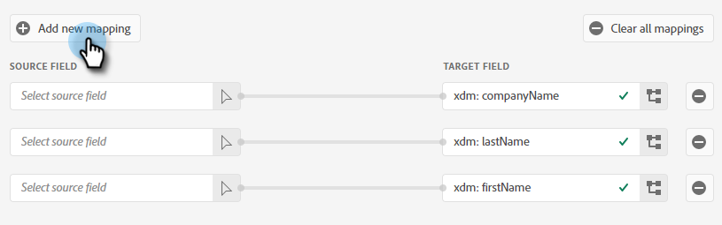
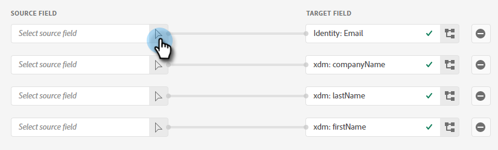

# Adobe Experience Platform 세그먼트를 Marketo 정적 목록에 푸시 {#push-an-adobe-experience-platform-segment-to-a-marketo-static-list}

이 기능을 사용하면 Adobe Experience Platform에 있는 세그먼트를 정적 목록의 형태로 Marketo Engage에 푸시할 수 있습니다.

>[!PREREQUISITES]
>
>* [API 역할 편집](/help/marketo/product-docs/administration/users-and-roles/create-delete-edit-and-change-a-user-role.md#edit-an-existing-role){target="_blank"} 다음을 포함했는지 확인 **읽기-쓰기 사용자** 권한(Access API 드롭다운 아래에 있음).
>* [API 사용자 만들기](/help/marketo/product-docs/administration/users-and-roles/create-an-api-only-user.md){target="_blank"} Marketo.
>* 다음으로 이동 **[!UICONTROL 관리자]** > **[!UICONTROL Launchpoint]**. 방금 만든 역할의 이름을 찾아 **[!UICONTROL 세부 사항 보기]**. 다음 위치에 정보 복사 및 저장 **[!UICONTROL 클라이언트 ID]** 및 **[!UICONTROL 클라이언트 암호]** 7단계에 필요할 수 있습니다.
>* Marketo에서 정적 목록을 만들거나 이미 만든 목록을 찾아 선택합니다. 신분증이 필요합니다.

1. 에 로그인 [Adobe Experience Platform](https://experience.adobe.com/){target="_blank"}.

   

1. 그리드 아이콘을 클릭하고 다음을 선택합니다. **[!UICONTROL Experience Platform]**.

   

1. 왼쪽 탐색 메뉴에서 **[!UICONTROL 대상]**.

   

1. 클릭 **[!UICONTROL 카탈로그]**.

   

1. Marketo Engage 타일을 찾고 **[!UICONTROL 활성화]**.

   

1. 클릭 **[!UICONTROL 새 대상 구성]**.

   

1. 계정 유형에서 기존 계정 또는 새 계정 라디오 단추를 선택합니다(이 예에서는 **[!UICONTROL 기존 계정]**). 계정 선택 아이콘을 클릭합니다.

   

   >[!NOTE]
   >
   >새 계정을 선택하는 경우, 다음 위치로 이동하여 먼치킨 ID를 찾을 수 있습니다. **[!UICONTROL 관리자]** > **[!UICONTROL 먼치킨]** (또한 로그인한 후 Marketo URL의 일부입니다.) 이 문서의 맨 위에 있는 사전 요구 사항을 따르지 않을 클라이언트 ID/암호입니다.

1. 대상 계정을 선택하고 **[!UICONTROL 선택]**.

   

1. 대상 입력 **[!UICONTROL 이름]** 및 선택적 설명. 개인 생성 드롭다운을 클릭하고 &quot;기존 Marketo 사용자와 일치하는 사용자 및 Marketo에서 누락된 사용자 생성&quot;을 선택합니다. _또는_ &quot;기존 Marketo 사람만 일치&quot;(이 예에서는 전자를 선택함) 또한 다음을 선택해야 합니다. **[!UICONTROL 작업 영역]**.

   

   >[!NOTE]
   >
   >&quot;기존 Marketo 사람만 일치&quot;를 선택하는 경우 이메일 및/또는 ECID만 매핑하면 되므로 13-16단계를 건너뛸 수 있습니다.

1. 이 섹션은 선택 사항입니다. 클릭 **[!UICONTROL 만들기]** 건너뛰기합니다.

   

1. 생성한 대상을 선택하고 **[!UICONTROL 다음]**.

   

1. Marketo으로 전송할 세그먼트를 선택하고 **[!UICONTROL 다음]**.

   

   >[!NOTE]
   >
   >여러 세그먼트를 선택하는 경우 세그먼트 일정 탭에서 각 세그먼트를 지정된 정적 목록에 매핑해야 합니다.

   >[!IMPORTANT]
   >
   >세그먼트가 Marketo 대상에 처음 활성화된 후 Marketo 대상을 활성화하기 전에 세그먼트에 이미 있던 프로필 다시 채우기는 다음 작업을 수행할 수 있습니다 _최대 24시간_. 앞으로 프로필이 세그먼트에 추가될 때마다 Marketo에 즉시 추가됩니다.

1. 클릭 **[!UICONTROL 새 매핑 추가]**.

   

1. 매핑 아이콘을 클릭합니다.

   

1. 원하는 속성을 선택하고 **[!UICONTROL 선택]**. 이 예제에서는 이름, 성 및 이메일 주소를 선택합니다.

   

   >[!NOTE]
   >
   >Experience Platform의 속성을 Marketo Engage에서 조직이 액세스할 수 있는 속성에 매핑할 수 있습니다. 사용 [API 요청 설명](https://experienceleague.adobe.com/en/docs/marketo-developer/marketo/rest/lead-database/lead-database#describe){target="_blank"} 조직에서 액세스할 수 있는 속성 필드를 검색합니다.

1. 을 클릭하여 성 및 회사 이름 매핑 **[!UICONTROL 새 매핑 추가]** 다시 한 번 15단계를 두 번 반복하여 **[!UICONTROL 성]** 그런 다음 **[!UICONTROL companyName]**.

   

1. 이제 이메일 주소를 매핑할 차례입니다. 클릭 **[!UICONTROL 새 매핑 추가]** 다시.

   

1. 매핑 아이콘을 클릭합니다.

   

1. ID 네임스페이스 선택 라디오 버튼을 클릭하고 다음을 선택합니다. **[!UICONTROL 이메일]**&#x200B;을 클릭한 다음 을 클릭합니다 **[!UICONTROL 선택]**.

   

   >[!IMPORTANT]
   >
   >에서 이메일 및/또는 ECID 매핑 **[!UICONTROL ID 네임스페이스]** 탭은 Marketo에서 개인이 일치하는지 확인하기 위해 수행하는 가장 중요한 작업입니다. 이메일 매핑은 가장 높은 일치율을 보장합니다.

1. 이제 소스 필드를 선택할 차례입니다. 이메일의 경우 커서 아이콘을 클릭합니다.

   

1. ID 네임스페이스 선택 라디오 단추를 클릭하고 **[!UICONTROL 이메일]**&#x200B;을 클릭한 다음 을 클릭합니다 **[!UICONTROL 선택]**.

   

1. 회사명 출처 필드를 선택하려면 해당 행에서 커서 아이콘을 누릅니다.

   

1. 속성 선택 라디오 단추를 선택된 상태로 둡니다. &quot;회사&quot;를 검색하고 선택 **[!UICONTROL companyName]**&#x200B;을 클릭한 다음 을 클릭합니다 **[!UICONTROL 선택]**.

   

1. 각 이름에 대한 커서 아이콘을 누르고 23단계를 두 번 반복하여 을 선택하여 성 및 이름에 대한 소스 필드를 매핑합니다. **[!UICONTROL 성]** 그런 다음 **[!UICONTROL 이름]**.

   

1. 클릭 **[!UICONTROL 다음]**.

   

1. 변경 사항을 검토하고 **[!UICONTROL 완료]**.

   
