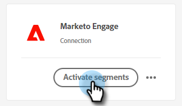
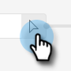

# Marketo 정적 목록에 Adobe Experience Platform 세그먼트 푸시 {#push-an-adobe-experience-platform-segment-to-a-marketo-static-list}

이 기능을 사용하면 Adobe Experience Platform에 있는 세그먼트를 정적 목록 형태로 Marketo에 푸시할 수 있습니다.

>[!PREREQUISITES]
>
>* [Marketo에서 API ](/help/marketo/product-docs/administration/users-and-roles/create-an-api-only-user.md) 사용자를 만듭니다.
>* 그런 다음 **관리** > **Launchpoint**&#x200B;로 이동합니다. 방금 만든 역할의 이름을 찾고 **세부 정보 보기**&#x200B;를 클릭합니다. 이 기능을 사용하려면 **클라이언트 ID** 및 **클라이언트 암호**&#x200B;에 정보를 복사하여 저장합니다.

1. [Adobe Experience Platform](https://experience.adobe.com/)에 로그인합니다.

   

1. 격자 아이콘을 클릭하고 **Experience Platform**&#x200B;을 선택합니다.

   

1. 왼쪽 탐색에서 **대상**&#x200B;을 클릭합니다.

   

1. **카탈로그**&#x200B;를 클릭합니다.

   

1. Marketo Engage 타일을 찾고 **세그먼트 활성화**&#x200B;를 클릭합니다.

   

1. **새 대상 구성**&#x200B;을 클릭합니다.

   PICC

1. 계정 유형에서 **새 계정** 라디오 단추를 클릭합니다. Marketo 자격 증명을 입력하고 **대상에 연결**&#x200B;을 클릭합니다.

   

   >[!NOTE]
   >
   >**Admin** > **Munchkin**(로그인하면 Marketo URL의 일부)으로 이동하여 Munchkin ID를 찾을 수 있습니다. 클라이언트 ID/비밀번호는 이 문서의 맨 위에 있는 사전 요구 사항을 따라야 합니다.

1. &quot;연결됨&quot;은 자격 증명 아래에 표시됩니다. 오른쪽 위 모서리에서 **다음**&#x200B;을 클릭합니다.

   

1. **이름** 및 _선택적_ 설명을 입력합니다. **대상 만들기**&#x200B;를 클릭합니다.

   >[!NOTE]
   >
   >마케팅 작업에서 항목을 선택하는 것도 선택 사항입니다. Marketo은 현재 해당 정보를 활용하지 않지만 곧 이용할 수 있습니다.

   

1. **다음**&#x200B;을 클릭합니다.

   

1. 원하는 세그먼트를 선택하고 **다음**&#x200B;을 클릭합니다.

   

   >[!NOTE]
   >
   >정적 목록에 대한 세그먼트는 1:1입니다. 여기에서 여러 세그먼트를 선택하는 경우, 세그먼트 예약 탭에서 지정된 정적 목록에 각 세그먼트를 매핑해야 합니다.

1. **새 매핑 추가**&#x200B;를 클릭합니다.

   

1. 커서 아이콘을 클릭합니다.

   

1. **속성 선택** 또는 **ID 네임스페이스 선택** 라디오 단추를 선택합니다(이 예에서는 속성을 선택합니다.).

   

   >[!NOTE]
   >
   >**ID 네임스페이스 선택**&#x200B;을 선택한 경우 선택한 후 15단계로 건너뜁니다.

1. 사용자를 식별하는 이메일 주소가 포함된 관련 필드를 선택합니다. 완료되면 **선택**&#x200B;을 클릭합니다.

   

   

   >[!NOTE]
   >
   >선택한 예는 선택한 예제와 많이 다를 수 있습니다.

1. 매핑 아이콘을 클릭합니다.

   

1. Target 필드를 선택하고 **선택**&#x200B;을 클릭합니다.

   

1. **다음**&#x200B;을 클릭합니다.

   

   >[!NOTE]
   >
   >ID는 Marketo에서 일치 항목을 찾는 데 사용됩니다. 일치하는 항목이 있으면 해당 사람이 정적 목록에 추가됩니다. 일치하는 항목을 찾을 수 없으면 해당 사람이 삭제됩니다(즉, Marketo에서 만들지 않음).

1. _Marketo_&#x200B;에서 정적 목록을 만들거나 이미 만든 정적 목록을 찾아 선택합니다. URL의 끝에서 매핑 ID를 복사합니다.

   

   >[!NOTE]
   >
   >최상의 결과를 얻으려면 Marketo에서 참조하는 목록이 비어 있는지 확인하십시오.

1. Adobe Experience Platform으로 돌아가서 방금 복사한 ID를 입력합니다. 시작 날짜를 선택합니다. 사람들은 선택한 종료 날짜까지 계속 동기화됩니다. 무기한 동기화하려면 종료 날짜를 비워 둡니다. 완료되면 **다음**&#x200B;을 클릭합니다.

   

1. 변경 내용을 확인하고 **완료**&#x200B;를 클릭합니다.

   
