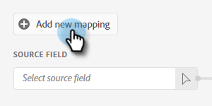

# 푸시 복제 {#push-clone}

이 기능을 사용하면 Adobe Experience Platform에 있는 세그먼트를 정적 목록 형태로 Marketo에 푸시할 수 있습니다.

>[!PREREQUISITES]
>
>* [API 사용자 만들기](/help/marketo/product-docs/administration/users-and-roles/create-an-api-only-user.md) Marketo.
>* 그런 다음 **관리** > **Launchpoint**. 방금 만든 역할의 이름을 찾아 **세부 사항 보기**. 정보를 복사하여 저장합니다 **클라이언트 ID** 및 **클라이언트 암호**&#x200B;을 가리키도록 업데이트하는 것이 좋습니다.
>* Marketo에서 정적 목록을 만들거나 이미 만든 정적 목록을 찾아 선택합니다. ID가 필요합니다.

1. 에 로그인합니다. [Adobe Experience Platform](https://experience.adobe.com/).

   

1. 격자 아이콘을 클릭하고 를 선택합니다 **Experience Platform**.

   

1. 왼쪽 탐색 메뉴에서 **대상**.

   

1. 클릭 **카탈로그**.

   

1. Marketo Engage 타일을 찾고 **세그먼트 활성화**.

   

1. 클릭 **새 대상 구성**.

   

1. 계정 유형에서 기존 또는 새 계정 라디오 단추를 선택합니다(이 예에서는 다음과 같이 선택합니다 **기존 계정**). 계정 선택 아이콘을 클릭합니다.

   

1. 대상 계정을 선택하고 **선택**.

   

1. 대상 입력 **이름** 및 선택적 설명. 개인 만들기 드롭다운을 클릭하고 &quot;Match Existing Marketo People and Create Missing People in Marketo&quot;을 선택합니다. _또는_ &quot;기존 Marketo 사용자만 일치&quot;합니다. 이 예에서는 이전 항목을 선택합니다.

   

   >[!NOTE]
   >
   >기존 Marketo 사용자만 일치 를 선택하는 경우 이메일 및/또는 ECID만 매핑하면 되므로 13~16단계를 건너뛸 수 있습니다.

1. 이 섹션은 선택 사항입니다. 클릭 **만들기** 을 클릭하여 건너뜁니다.

   

1. 만든 대상을 선택하고 을(를) 클릭합니다 **다음**.

   

1. Marketo에 보낼 세그먼트를 선택하고 **다음**.

   

1. 클릭 **새 매핑 추가**.

   

1. 매핑 아이콘을 클릭합니다.

   

1. 을 선택하여 이름 매핑 **firstName** 및 **선택**.

   

1. 을 클릭하여 성 및 회사 이름 매핑 **새 매핑 추가** 다시 15단계를 두 번 반복하여 **lastName** 그리고 **companyName**.

   

1. 이제 이메일 주소를 매핑할 차례입니다. 클릭 **새 매핑 추가** 다시 한 번

   

1. 매핑 아이콘을 클릭합니다.

   

1. Select Identity Namespace 라디오 단추를 클릭하고  **이메일**&#x200B;를 클릭한 다음 **선택**.

   

1. 이제 소스 필드를 선택할 차례입니다. 전자 메일의 경우 커서 아이콘을 클릭합니다.

   

1. ID 네임스페이스 선택 라디오 단추를 클릭하고 을 찾아 선택합니다 **이메일**&#x200B;를 클릭한 다음 **선택**.

   

1. 회사 이름 출처 필드를 선택하려면 해당 행에서 커서 아이콘을 누릅니다.

   

1. 속성 선택 라디오 단추를 선택된 상태로 두십시오. &quot;company&quot;를 검색하고 선택합니다. **companyName**&#x200B;를 클릭한 다음 **선택**.

   

1. 각각에 대한 커서 아이콘을 클릭하고 23단계를 두 번 반복하여 성 및 이름에 대한 소스 필드를 매핑합니다. **lastName** 그리고 **firstName**.

   

1. 클릭 **다음**.

   

1. 이제 목록의 ID가 필요합니다. 브라우저에서 Marketo 정적 목록이 있는 탭을 클릭하거나 새 탭을 열고 원하는 정적 목록을 선택합니다.

   

1. URL 끝에 있는 목록 ID를 강조 표시하고 복사합니다.

   

1. 매핑 ID 아래에 방금 복사한 ID를 붙여넣고 를 클릭합니다 **다음**.

   

1. 클릭 **완료**.

   
