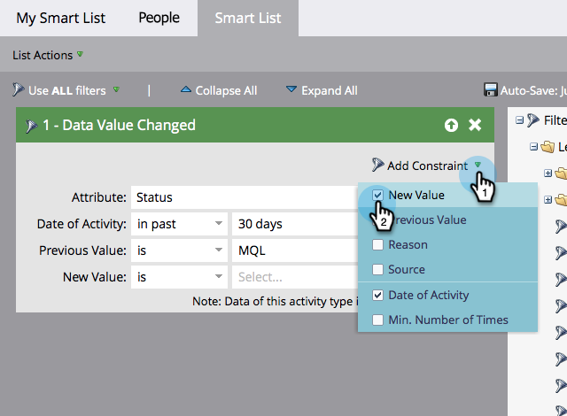
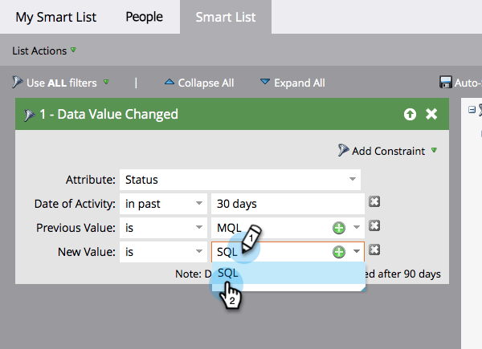

# 스마트 목록 필터에 제약 조건 추가 {#add-a-constraint-to-a-smart-list-filter}

스마트 목록을 만들 때 일부 필터에는 &quot;제한&quot;이라는 고급 옵션이 있습니다. 이러한 조건은 검색을 훨씬 더 좁히는 데 도움이 되도록 필터 및 트리거에 추가할 수 있는 추가 조건입니다.

이 예제에서는 **[변경된 데이터 값](/help/marketo/product-docs/core-marketo-concepts/smart-campaigns/flow-actions/change-data-value.md){target="_blank"}** 필터에 일부 제약 조건을 추가하여 MQL에서 SQL로 상태가 변경된 사람을 찾도록 하겠습니다.

>[!PREREQUISITES]
>
>* [스마트 목록 만들기](/help/marketo/product-docs/core-marketo-concepts/smart-lists-and-static-lists/creating-a-smart-list/create-a-smart-list.md){target="_blank"}
>* [스마트 목록에서 &quot;변경된 데이터 값&quot; 필터 사용](/help/marketo/product-docs/core-marketo-concepts/smart-lists-and-static-lists/using-smart-lists/use-the-data-value-changed-filter-in-a-smart-list.md){target="_blank"}

1. **[!UICONTROL Marketing Activities]** 으로 이동합니다.

   

1. 제한을 추가할 필터가 있는 스마트 목록을 선택하고 **[!UICONTROL Smart List]** 탭을 클릭합니다.

   

1. **[!UICONTROL Add Constraint]**&#x200B;에서 **[!UICONTROL Previous Value]**&#x200B;을(를) 선택합니다.

   

1. **[!UICONTROL Previous Value]** 입력. 이 예에서는 MQL을 사용합니다.

   

1. **[!UICONTROL Add Constraint]**&#x200B;에서 **[!UICONTROL New Value]**&#x200B;을(를) 선택합니다.

   

1. 새 값을 입력합니다. 이 예제에서는 SQL을 사용합니다.

   

1. 잘했어! 지난 30일 동안 상태가 &quot;MQL&quot;에서 &quot;SQL&quot;로 변경된 모든 사람을 보려면 **[!UICONTROL People]** 탭을 클릭하십시오.
