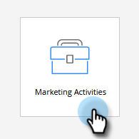
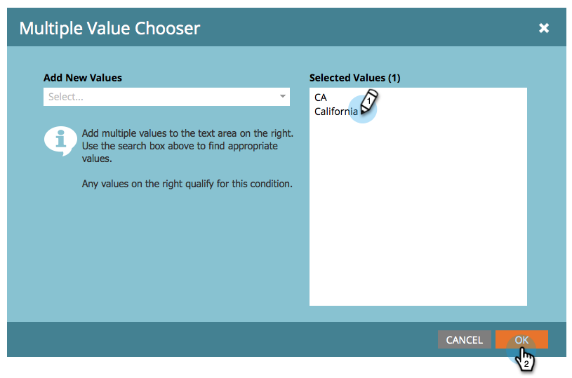

# 스마트 목록 필터에 여러 값 추가 {#add-multiple-values-to-a-smart-list-filter}

>[!PREREQUISITES]
>
>* [스마트 목록 만들기](/help/marketo/product-docs/core-marketo-concepts/smart-lists-and-static-lists/creating-a-smart-list/create-a-smart-list.md){target="_blank"}
>* [스마트 목록에 필터 찾기 및 추가](/help/marketo/product-docs/core-marketo-concepts/smart-lists-and-static-lists/creating-a-smart-list/find-and-add-filters-to-a-smart-list.md){target="_blank"}

California에서 모든 사람을 찾고 싶지만 데이터베이스에 &quot;California&quot;와 &quot;CA&quot;를 모두 저장할 수 있다고 가정합니다. 적용 가능한 모든 사람을 포함하려면 두 개의 [!UICONTROL State] 필터를 사용할 수 있지만 한 개의 필터로 더 쉽게 만들 수 있습니다.

1. **[!UICONTROL Marketing Activities]** 으로 이동합니다.

   

1. 스마트 목록을 찾아 선택하고 **[!UICONTROL Smart List]** 탭을 클릭합니다.

   

1. 필터에서 **+**&#x200B;을(를) 클릭합니다.

   

1. 왼쪽에서 값을 선택하거나 오른쪽에 입력한 다음 **[!UICONTROL OK]**&#x200B;을(를) 클릭합니다.

   

>[!MORELIKETHIS]
>
>* [스마트 목록 필터에 제한 추가](/help/marketo/product-docs/core-marketo-concepts/smart-lists-and-static-lists/using-smart-lists/add-a-constraint-to-a-smart-list-filter.md){target="_blank"}
>* [스마트 목록에서 고급 필터 사용](/help/marketo/product-docs/core-marketo-concepts/smart-lists-and-static-lists/using-smart-lists/using-advanced-smart-list-rule-logic.md){target="_blank"}
