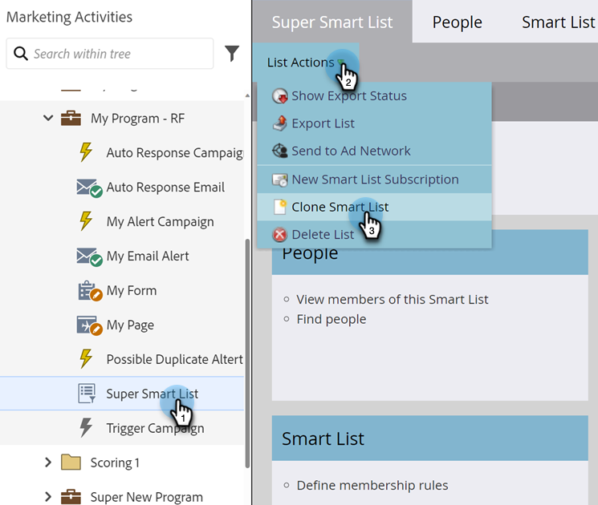

# 목록 또는 스마트 목록 복제 {#clone-a-list-or-smart-list}

처음부터 스마트 목록을 만드는 대신 유사한 목록을 복제하고 변경하여 시간을 절약하십시오. 방법은 다음과 같습니다.

1. **[!UICONTROL 마케팅 활동]**(으)로 이동합니다.

   

1. 복제할 스마트 목록을 선택합니다. **[!UICONTROL 목록 작업]**&#x200B;에서 **[!UICONTROL 스마트 목록 복제]**&#x200B;를 클릭합니다.

   

1. **[!UICONTROL 이름]**&#x200B;을(를) 입력하고 **[!UICONTROL 복제]**&#x200B;를 클릭합니다.

   

잘했어! 동일한 방식으로 일반 목록을 복제할 수도 있습니다.
