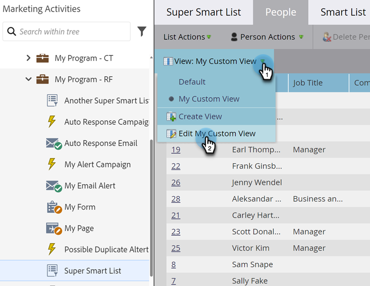

# 목록 및 스마트 목록 보기 만들기 및 변경 {#create-and-change-views-for-lists-and-smart-list}

스마트 목록에는 기본 열 세트가 표시됩니다. 그 열들을 마음껏 편집할 수 있다는 것을 알고 있었습니까? 방법은 다음과 같습니다.

## 보기 만들기 {#create-a-view}

1. 목록 또는 스마트 목록으로 이동하여 **[!UICONTROL People]** 탭을 클릭하고 **[!UICONTROL Create View]** 드롭다운 아래의 **[!UICONTROL View]**&#x200B;을(를) 클릭합니다.

   

1. 보기의 이름을 지정하고 추가하거나 제거할 열을 찾습니다.

   

1. 원하는 열을 추가/제거한 다음 **[!UICONTROL Create]**&#x200B;을(를) 클릭합니다.

   

>[!TIP]
>
>빠르게 검색하려면 **[!UICONTROL Find]** 상자를 사용하십시오.

## 보기 전환 {#switch-views}

1. **[!UICONTROL View]** 드롭다운을 클릭한 다음 원하는 보기를 선택합니다. 필요에 따라 보기 사이를 전환합니다.

   

>[!NOTE]
>
> 뷰를 전환하려면 먼저 기본 뷰 외에 두 번째 뷰를 만들어야 합니다.

## 보기 편집 {#edit-a-view}

1. 편집할 보기를 **[!UICONTROL View]** 드롭다운에서 선택해야 합니다.

   

1. **[!UICONTROL Edit]** 옵션을 클릭합니다.

   

1. 원하는 대로 변경하고 **[!UICONTROL Save]**&#x200B;을(를) 클릭합니다.

   

## 보기 삭제 {#delete-a-view}

1. **[!UICONTROL Edit]** 드롭다운에서 삭제할 보기에 대한 **[!UICONTROL View]** 옵션을 선택합니다.

   

1. **[!UICONTROL Delete]**&#x200B;을(를) 클릭합니다.

   

보기 드롭다운에서 만든 사용자 정의 보기를 사용자만 볼 수 있으므로 친구들에게 직접 만들어야 한다고 알립니다!

>[!MORELIKETHIS]
>
>* [기본 제공/시스템 스마트 목록 사용](/help/marketo/product-docs/core-marketo-concepts/smart-lists-and-static-lists/using-smart-lists/use-built-in-system-smart-lists.md){target="_blank"}
>* [스마트 목록 만들기](/help/marketo/product-docs/core-marketo-concepts/smart-lists-and-static-lists/creating-a-smart-list/create-a-smart-list.md){target="_blank"}
